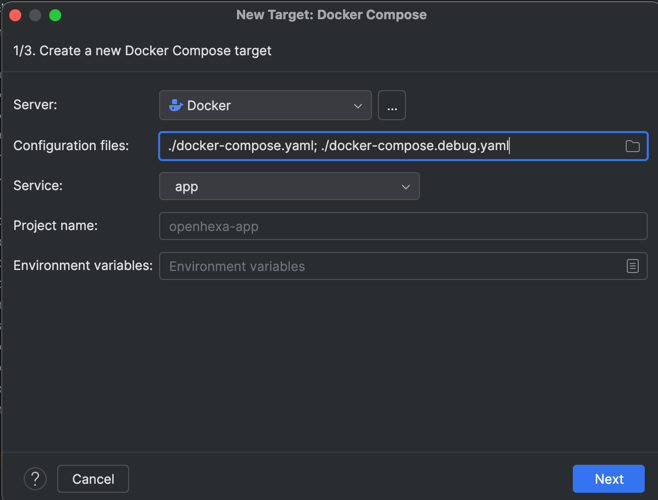
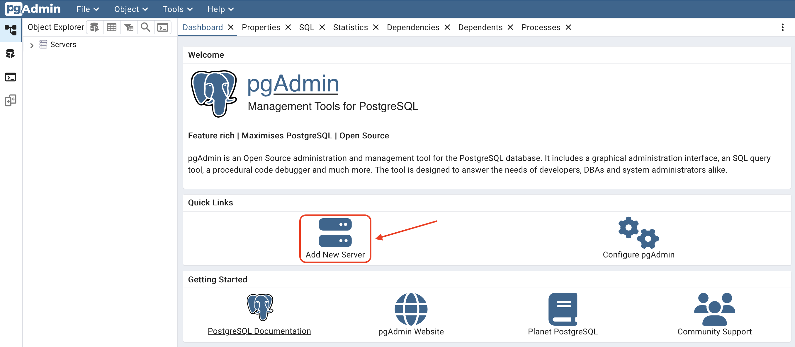
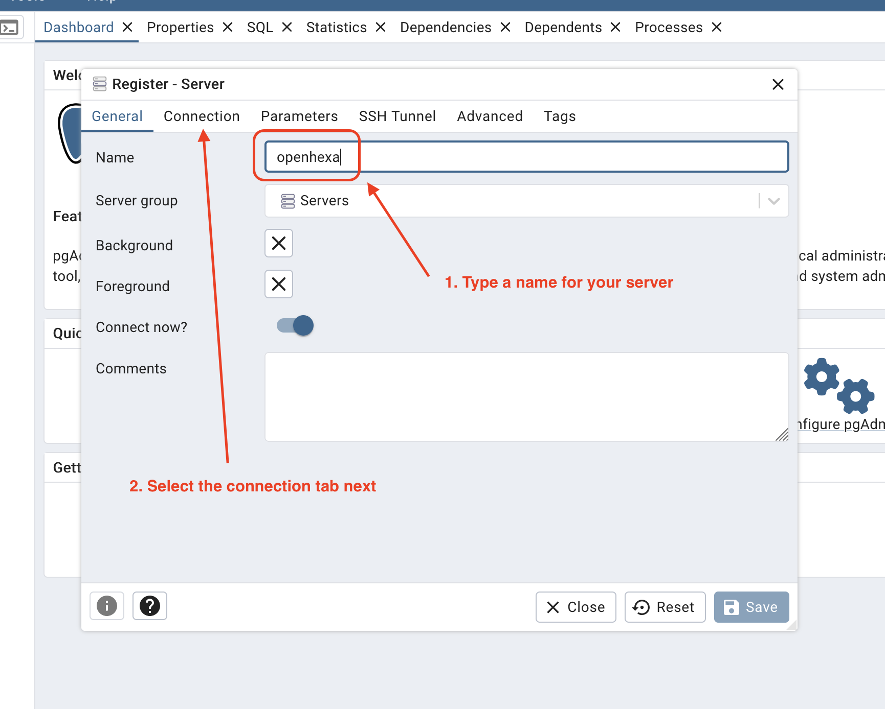
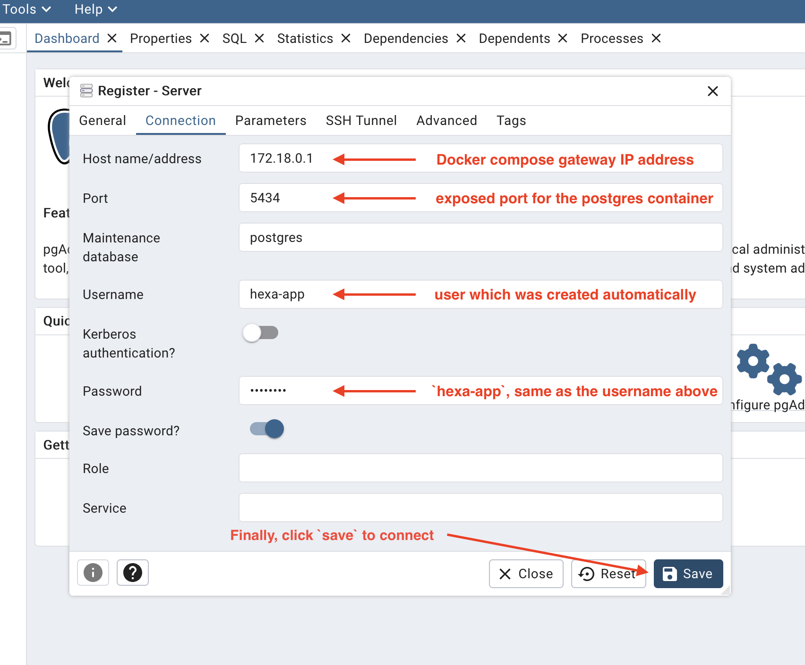

<div align="center">
   
</div>
<p align="center">
    <em>Open-source Data integration platform</em>
</p>
<p align="center">
   <a href="https://github.com/BLSQ/openhexa-app/actions/workflows/test.yml">
      
   </a>
</p>

OpenHEXA App Component
======================

OpenHEXA is an open-source data integration platform developed by [Bluesquare](https://bluesquarehub.com).

Its goal is to facilitate data integration and analysis workflows, in particular in the context of public health 
projects.

Please refer to the [OpenHEXA wiki](https://github.com/BLSQ/openhexa/wiki/Home) for more information about OpenHEXA.

This repository contains the code for what we call the `app` component, which mostly offers a GraphQL API and an 
infrastructure to run data pipelines.

Docker image
------------

OpenHEXA App is published as a Docker Image on Docker Hub:
[blsq/openhexa-app](https://hub.docker.com/r/blsq/openhexa-app).

You can use `docker run blsq/openhexa-app help` to list the available commands.

Local development
-----------------

The [Installation instructions](https://github.com/BLSQ/openhexa/wiki/Installation-instructions#development-installation) 
section of our wiki gives an overview of the local development setup required to run OpenHEXA locally.

To ease the setup of the environment and management of dependencies, we are using containerization, in particular
[Docker](https://www.docker.com/). As such, we provide a `docker-compose.yaml` file for local development. 

When running the App component using `docker compose`, the code of this repository is mounted as a volume within the 
container, so that any change you make in your local copy of the codebase is directly reflected in the running 
container.

The following steps will get you up and running:

```bash
cp .env.dist .env  # adapt the .env file with the required configuration values
# Set WORKSPACE_STORAGE_LOCATION to a local directory to use a local storage backend for workspaces
docker network create openhexa
docker compose build
docker compose run app fixtures
docker compose up
```

This will correctly configure all the environment variables, fill the database with some initial data and start the base
`db` and `app` services. The app is then exposed on `localhost:8000`. Two main paths are available:

- http://localhost:8000/graphql for the GraphQL API
- http://localhost:8000/ready for the readiness endpoint 

Anything else will be redirected to the frontend served at `http://localhost:3000`.

You can then log in with the following credentials: `root@openhexa.org`/`root`

Python requirements are handled with [pip-tools](https://github.com/jazzband/pip-tools), you will need to install it.
When you want to add a requirement, simply update `requirements.in` and run `pip-compile` in the root directory. You
can then rebuild the Docker image.

### Debugging

If you want to run the app in debugger mode, you can override the default command to execute by adding a 
`docker-compose.debug.yaml` file in order to use the your favorite debugger package and wait for a debugger to attach.

#### Using `debugpy` for **VSCode**

```yaml
# docker-compose.debug.yaml

services:
  app:
    entrypoint: []
    command:
      - "sh"
      - "-c"
      # If you want to wait for the debugger client to be attached before running the server
      # - |
      #   pip install debugpy \
      #   && python -m debugpy --listen 0.0.0.0:5678 --wait-for-client /code/manage.py runserver 0.0.0.0:8000
      - |
        pip install debugpy \
        && python -m debugpy --listen 0.0.0.0:5678 /code/manage.py runserver 0.0.0.0:8000
    ports:
      - "8000:8000"
      - "5678:5678"
```

You can then add a new configuration in VSCode to run the app in debugger mode:


```json
# .vscode/launch.json

{
    "version": "0.2.0",
    "configurations": [
        {
            "name": "Attach OpenHEXA Debugger",
            "type": "debugpy",
            "request": "attach",
            "connect": {
                "host": "localhost",
                "port": 5678
            },
            "pathMappings": [
                {
                    "localRoot": "${workspaceFolder}",
                    "remoteRoot": "/code"
                }
            ],
            "django": true,
            "justMyCode": false
        }
    ]
}
```

Run the app with `docker compose -f docker-compose.yaml -f docker-compose.debug.yaml up` & start the debugger from VSCode.

#### Using **Pycharm**

```yaml
# docker-compose.debug.yaml

services:
  app:
    entrypoint: []
    # Used when running in normal mode.
    command: ["/code/docker-entrypoint.sh", "manage", "runserver", "0.0.0.0:8000"]
    ports:
      - "8000:8000"
```

Create a new interpreter configuration in Pycharm with the following settings:



Create a new django server run configuration by setting the following options:
- Python interpreter: The one you just created
- In "Docker Compose" section; Command and options: `-f docker-compose.yaml -f docker-compose.debug.yaml up`

Run the configuration in debug mode.

### PgAdmin as dev tool

For development purposes, you can define a pgAdmin service as Docker container. In this example, let's say in *docker-compose.dev.yaml*.

```yaml
# docker-compose.dev.yaml

services:
  pgadmin:
    image: dpage/pgadmin4
    environment:
      PGADMIN_DEFAULT_EMAIL: ${PGADMIN_DEFAULT_EMAIL:-root@openhexa.org}
      PGADMIN_DEFAULT_PASSWORD: ${PGADMIN_DEFAULT_PASSWORD:-root}
      PGADMIN_CONFIG_SERVER_MODE: "False"
      PGADMIN_CONFIG_MASTER_PASSWORD_REQUIRED: "False"
    ports:
      - "${PGADMIN_PORT:-5050}:80"
    depends_on:
      - db
    networks:
      - openhexa
    volumes:
      - pgadmin_data:/var/lib/pgadmin4

volumes:
  pgadmin_data:
```

Next run the following command:

```bash
docker compose -f docker-compose.yaml -f docker-compose.dev.yaml [-f docker-compose.debug.yaml] up
```

In the browser, go to http://localhost:5050 and log in using credentials defined in the *docker-compose.dev.yaml* file.



Finally create a new connection to the server:





The address of the server must be the one of the database container gateway, on the 5434 port.

### Running with the frontend

By default, we assume that the frontend is served outside from this project. If you want to run the frontend locally,
you can use the `frontend` profile:

```bash
docker compose --profile frontend up
```

The frontend is then served on `http://localhost:3000`.

By default, the `latest` tag will be used but you can set a PR number or use the main branch:

```bash
FRONTEND_VERSION=main docker compose --profile frontend up
FRONTEND_VERSION=pr-604 docker compose --profile frontend up
```

### Pipelines

If you need the pipelines or want to work on them, there are 2 optional services to run: `pipelines_runner` and/or
`pipelines_scheduler`. You can run them with the following command **instead of** `docker compose up`:

```bash
docker compose --profile pipelines up
```

The [Writing OpenHEXA pipelines](https://github.com/BLSQ/openhexa/wiki/Writing-OpenHexa-pipelines) section of the wiki 
contains the instructions needed to build and deploy a data pipeline on OpenHEXA.

To deploy and run data pipelines locally, you will need to:

1. Create a workspace on your local instance
2. Configure the SDK to use your local instance as the backend

```bash
openhexa config set_url http://localhost:8000
```

You can now deploy your pipelines to your local OpenHEXA instance.

Please refer to the [SDK documentation](https://github.com/BLSQ/openhexa-sdk-python/blob/main/README.md#using-a-local-installation-of-openhexa-to-run-pipelines)
for more information.

### Dataset worker
Generation of file samples and metadata calculation are done in separate worker, in order to run it locally you 
can make use of `dataset_worker` by adding `dataset_worker` profile to the list of enabed profiles.

````
docker compose --profile dataset_worker up
````

### Data worker

If you need the optional services `dataworker`, you can run the following command **instead of** `docker compose up`:

```bash
docker compose --profile dataworker up 
```

### Running commands on the container

The app Docker image contains an entrypoint. You can use the following to list the available commands:

```bash
docker compose run app help
```

As an example, use the following command to run the migrations:

```bash
docker compose run app migrate
```

### Analytics
We use [Mixpanel](https://mixpanel.com/home/) to track users and their actions. If you want to enable it, set the `MIXPANEL_TOKEN` environment variable with the token from your Mixpanel project and restart the application.

### Running the tests

Running the tests is as simple as:

```bash
docker compose run app test --settings=config.settings.test
```

Some tests call external resources (such as the public DHIS2 API) and will slow down the suite. You can exclude them
when running the test suite for unrelated parts of the codebase:

```bash
docker compose run app test --exclude-tag=external --settings=config.settings.test
```

You can run a specific test as it follows:

```bash
docker compose run app test hexa.core.tests.CoreTest.test_ready_200 --settings=config.settings.test
```

There are many other options, if you want to find out more, look at the [documentation of Django test harness](https://docs.djangoproject.com/en/4.2/topics/testing/overview/#running-tests),
as it is what we are using.

### I18N

You can extract the strings to translate with the following command:

```bash
docker compose run app manage makemessages -l fr # Where fr is the language code
```

You can then translate the strings in the `hexa/locale` folder.

To compile the translations, run the following command:

```bash
docker compose run app manage compilemessages
```

### Code style

Our python code is linted using [`ruff`](https://docs.astral.sh/ruff/). It also handles code formatting, and import sorting.


We currently target the Python 3.9 syntax.

We use a [pre-commit](https://pre-commit.com/) hook to lint the code before committing. Make sure that `pre-commit` is
installed, and run `pre-commit install` the first time you check out the code. Linting will again be checked
when submitting a pull request.

You can run the lint tools manually using `pre-commit run --all`.

## Versioning

This library follows [Semantic Versioning](http://semver.org/).
Tagging and releases' creation are managed by [release-please](https://github.com/googleapis/release-please) that will create and maintain a pull request with 
the next release based on the [commit messages of the new commits](#how-should-i-write-my-commits).

Triggering a new release is done by merging the pull request created by release-please. The result is:
* the changelog.md is updated with the commit messages
* a GitHub release is created
* a docker image is built for the new tag and pushed on the docker registry

### Release Branches

Release-please also run on release branches named `release/*` (ex: release/0.81) for maintaining older versions. When working on a release branch:

1. The same conventional commit format should be used
2. Release-please will create and maintain a PR for the next patch version on that branch
3. Changes can be cherry-picked or implemented directly on the release branch
4. Merging the PR created by release-please will trigger a new patch release for that version

This approach allows us to maintain multiple versions simultaneously while ensuring proper semantic versioning for each release line.

## How should I write my commits?

This project assumes you are using [Conventional Commit messages](https://www.conventionalcommits.org/).

The most important prefixes you should have in mind are:

* `fix:` which represents bug fixes, and correlates to a [SemVer](https://semver.org/)
  patch.
* `feat:` which represents a new feature, and correlates to a SemVer minor.
* `feat!:`,  or `fix!:`, `refactor!:`, etc., which represent a breaking change
  (indicated by the `!`) and will result in a SemVer major.