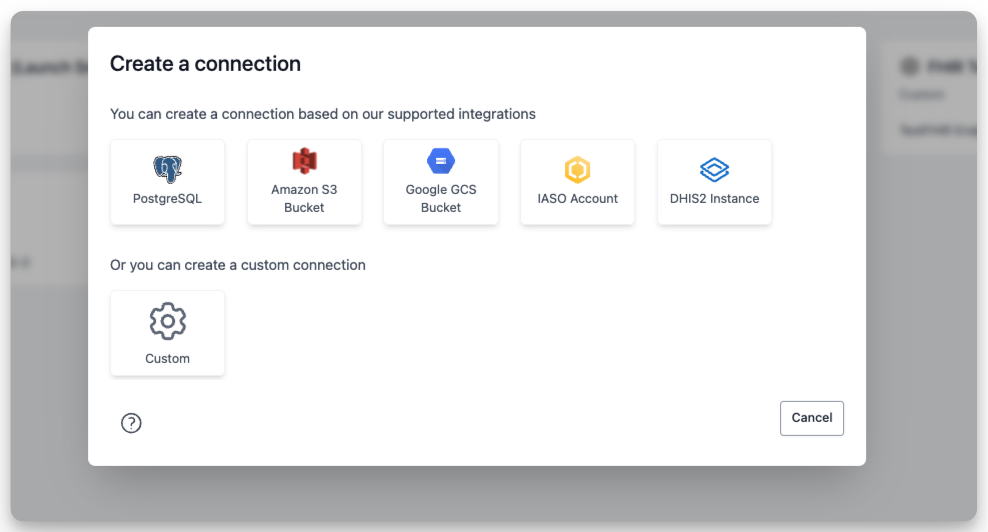

  <h1><i class="fas fa-hexagon" style="margin-right: 0.5rem;"></i>Connections</h1>

Connections are external data sources that you use within a workspace. They serve two purposes in OpenHEXA:

1. They let you safely **store credentials** for external data systems, so you can reuse them in notebooks and data pipelines
2. They help you **document** which data sources you use within a workspace and how you use them

!!! info "Connection permissions by role"
    - **Viewers**: Can view the list of connections but cannot use or manage them
    - **Editors**: Can view, use connections in notebooks and pipelines, but cannot create or delete connections
    - **Admins**: Can view, use, create, edit, and delete connections

You can use workspace connections in [OpenHEXA notebooks](notebooks.md) and [OpenHEXA data pipelines](pipelines.md).

OpenHEXA supports the following connection types:

- PostgreSQL
- [DHIS2](https://dhis2.org/)
- [IASO](https://openiaso.com)
- S3 (Amazon Web Services)
- GCS (Google Cloud Platform)
- Custom

## Use built-in connection types

Using the built-in connection types (PostgreSQL, DHIS2, S3, or GCS) is straightforward. You just need to fill out the connection creation form.

These built-in connection types have two fields in common:

- **Connection name**: The name OpenHEXA displays on the connections screen. You can choose any name you want.
- **Description**: Optional. Use this to document the purpose of the data source within your workspace.

A unique identifier is added to the connection based on the connection's name.

## Use custom connections

Custom connections are useful for storing credentials for systems that OpenHEXA doesn't support natively.

Like built-in connections, custom connections have a name and an optional description. You can add any number of fields to your custom connection and flag them as secret if they contain sensitive information (like passwords or API tokens).