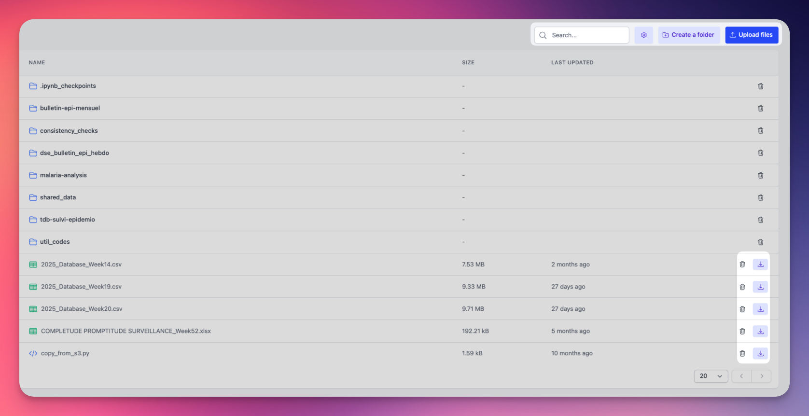

  <h1><i class="fas fa-hexagon" style="margin-right: 0.5rem;"></i>Files</h1>

Every workspace includes a shared filesystem that serves as the foundation for OpenHEXA's data lakehouse architecture. This filesystem provides:

- A centralized location for storing raw data files before processing
- Intermediate storage for data transformations and pipelines
- Support for structured and unstructured data
- Integration with data processing tools like notebooks and pipelines

The file browser interface provides several key features:

- Search for files and folders by name
- Toggle visibility of hidden files (starting with ".")
- Create folders to organize your workspace (Editors and Admins only)
- Upload files or entire folders to your workspace (Editors and Admins only)

Files are displayed in a table showing:

- File/folder names with type icons
- File sizes in readable format
- Last modified dates with sorting capability

You can perform common file operations:

- Download files to your local machine (all workspace members)
- Delete files and folders when no longer needed (Editors and Admins only)

!!! info "File permissions by role"
    - **Viewers**: Can browse, search, and download files
    - **Editors and Admins**: Can browse, search, download, upload, create folders, and delete files

## Integration with OpenHEXA tools

The workspace filesystem integrates seamlessly with other OpenHEXA components:

- **Notebooks**: Access files directly from Jupyter notebooks using the workspace filesystem. See [Notebooks](notebooks.md).
- **Data Pipelines**: Read and write files in your data processing workflows. See [OpenHEXA SDK](https://github.com/BLSQ/openhexa/wiki/Using-the-OpenHEXA-SDK).
