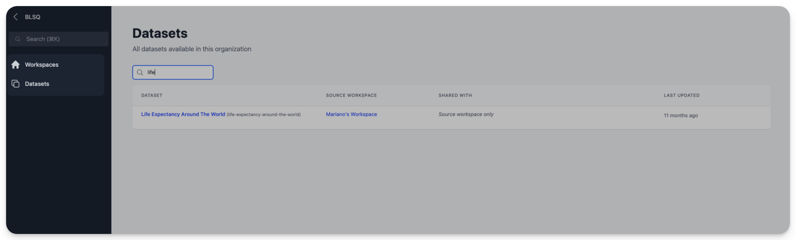

  <h1><i class="fas fa-hexagon" style="margin-right: 0.5rem;"></i>Navigation</h1>

This guide covers the key navigation features that help you move between organizations and workspaces, and find resources quickly across the platform.

## Organization and workspace navigation

### Understanding the hierarchy

OpenHEXA organizes content in a hierarchical structure:

- **Organizations**: Top-level entities that contain multiple workspaces
- **Workspaces**: Collaborative environments where you work on specific projects, datasets, and pipelines
- **Resources**: Individual items like datasets, pipelines, files, and connections within workspaces

You can belong to multiple organizations and have different permission levels in each one. For example, you might be:

- An Admin in one organization but a Viewer in another
- Have access to all workspaces in Organization A but only specific workspaces in Organization B (see example below)
{ width="60%" }
- Be an Editor in some workspaces but a Viewer in others

### Organization level view

If you're a member of the organization without Admin or Owner permissions, the organization level view provides an overview of all workspaces and datasets you can access within your current organization.

#### Access the view

1. In the left navigation panel, click the organization name.
2. You'll see a grid or list of all accessible workspaces and datasets.

{ width="30%" }

## Spotlight search

Spotlight search is a powerful feature that helps you quickly find anything you have access to in OpenHEXA—across all your workspaces. Click the search bar at the top of the left sidebar.

The search panel appears centered on your screen.

### Use spotlight search

1. **Start typing**: Enter a few letters of what you're looking for.
2. **View results**: OpenHEXA instantly displays matching results grouped by category across all selected workspaces.
3. **Go to results**: Click any result to go directly to that resource.

!!! info "Search tips"
	- **Partial matching**: You don't need to type the full name—partial matches work well
	- **Category filtering**: Results are automatically grouped by type for easy browsing
	- **Quick access**: Press `Cmd + K` (on macOS) or `Ctrl + K` (on Windows/Linux) for faster access 

## Workspace context switching

When you have access to multiple workspaces, you can easily switch between them using the workspace selector menu in the top-left corner of the screen.

### Switch workspaces

1. **Find the workspace selector**: Look for the dropdown menu in the top-left corner.
2. **Click to expand**: Click the current workspace name to see all available workspaces.
3. **Select destination**: Choose the workspace you want to switch to.
4. **Automatic navigation**: You'll go directly to the selected workspace.

Learn more about workspaces in the [Workspaces](workspaces.md) section of the user manual.

## Switch organizations

When you belong to multiple organizations in OpenHEXA, you can easily switch between them to access different sets of workspaces.

### How to switch organizations

1. **Find your current organization**: Look for your active organization name at the top of the left sidebar.
2. **Access organization view**: Click the organization name to see the [organization level view](#organization-level-view).
3. **Switch organizations**: Click the organization name again to get a list of all organizations you belong to.
4. **Select destination**: Choose the organization you want to switch to.

