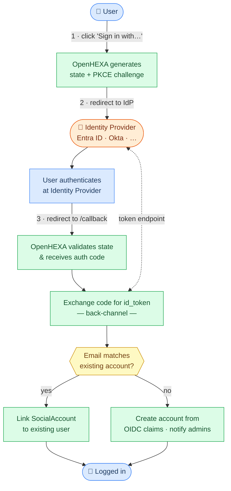

<div class="hero-section">
  <h1><i class="fas fa-hexagon" style="margin-right: 0.5rem;"></i>Single Sign-On (SSO)</h1>
</div>
</div>

OpenHEXA supports external login via any **OpenID Connect (OIDC)** identity provider — including Microsoft Entra ID (Azure AD), Google, Okta, and similar services. When at least one provider is configured, a login button for that provider appears on the sign-in page. Users are auto-provisioned on first login; existing users are linked by email address.

## How it works



The login flow uses the standard Authorization Code grant with PKCE:

1. The user clicks the **Sign in with &lt;Provider&gt;** button.
2. The browser is redirected to the identity provider's authorization endpoint.
3. After authentication, the provider redirects back to `/accounts/oidc/{provider_id}/login/callback/`.
4. OpenHEXA validates the `state` parameter and exchanges the code for tokens.
5. The user's email claim is used to find or create an OpenHEXA account.

!!! info "Password login"
    When any OIDC provider is configured, the password login form is hidden automatically. This is intentional for deployments where all users must authenticate through the identity provider. Enabling both methods simultaneously is not supported.

## Configuring a provider

Set the following environment variables in your deployment:

| Variable | Required | Description |
|---|---|---|
| `OIDC_PROVIDERS` | Yes | Comma-separated list of provider IDs, e.g. `who` or `who,wfp`. |
| `OIDC_{ID}_CLIENT_ID` | Yes | OAuth2 client ID issued by the identity provider. |
| `OIDC_{ID}_SERVER_URL` | Yes | OIDC discovery base URL. OpenHEXA fetches `{SERVER_URL}/.well-known/openid-configuration` to discover all endpoints automatically. |
| `OIDC_{ID}_CLIENT_SECRET` | No | OAuth2 client secret. Required for confidential clients. |
| `OIDC_{ID}_DISPLAY_NAME` | No | Label shown on the login button. Defaults to the provider ID uppercased. |
| `OIDC_{ID}_NEW_ACCOUNT_EMAIL_RECIPIENTS` | No | Comma-separated list of admin email addresses to notify when a new OpenHEXA account is auto-created via this provider. |

**Naming convention:** Replace `{ID}` with the provider ID uppercased. Hyphens in provider IDs map to underscores, so provider `who-ciam` uses `OIDC_WHO_CIAM_CLIENT_ID`.

### Single provider example

```bash
OIDC_PROVIDERS=who
OIDC_WHO_CLIENT_ID=your-client-id
OIDC_WHO_CLIENT_SECRET=your-client-secret
OIDC_WHO_SERVER_URL=https://login.microsoftonline.com/{TENANT_ID}/v2.0
OIDC_WHO_DISPLAY_NAME=WHO
OIDC_WHO_NEW_ACCOUNT_EMAIL_RECIPIENTS=admin@example.org,ops@example.org
```

### Multiple providers example

```bash
OIDC_PROVIDERS=who,wfp
OIDC_WHO_CLIENT_ID=...
OIDC_WHO_CLIENT_SECRET=...
OIDC_WHO_SERVER_URL=https://login.microsoftonline.com/{WHO_TENANT_ID}/v2.0
OIDC_WHO_DISPLAY_NAME=WHO

OIDC_WFP_CLIENT_ID=...
OIDC_WFP_CLIENT_SECRET=...
OIDC_WFP_SERVER_URL=https://login.microsoftonline.com/{WFP_TENANT_ID}/v2.0
OIDC_WFP_DISPLAY_NAME=WFP
```

## Microsoft Entra ID (Azure AD)

WHO CIAM and many other enterprise identity providers run on Microsoft Entra ID. The setup requires registering OpenHEXA as an application in your Azure tenant.

### Azure app registration

1. In the [Azure portal](https://portal.azure.com), go to **Azure Active Directory → App registrations → New registration**.
2. Set the redirect URI to `https://{your-domain}/accounts/oidc/{provider_id}/login/callback/` (type: **Web**).
3. Under **Certificates & secrets**, create a new client secret and note the value.
4. Note the **Application (client) ID** and **Directory (tenant) ID** from the app overview page.

### Required scopes

OpenHEXA requests `openid profile email`. Ensure these scopes are granted in the Azure app registration under **API permissions**. The `email` and `profile` claims must be included in the ID token — verify this under **Token configuration**.

### Environment variables

```bash
OIDC_{ID}_SERVER_URL=https://login.microsoftonline.com/{TENANT_ID}/v2.0
```

Entra ID's discovery document is served at `{SERVER_URL}/.well-known/openid-configuration`, which OpenHEXA fetches automatically.

!!! info "email_verified claim"
    Entra ID often omits the `email_verified` claim entirely. OpenHEXA treats a missing claim as verified, which is correct for Entra ID since email verification is enforced at the identity provider level.

## Account behaviour

### New users

When a user authenticates for the first time and no OpenHEXA account exists for their email address:

1. An account is created automatically using the OIDC claims: `email`, `given_name` (or `first_name`), and `family_name` (or `last_name`).
2. The account has no usable password — the user can only log in via the identity provider.
3. If `OIDC_{ID}_NEW_ACCOUNT_EMAIL_RECIPIENTS` is set, a notification email is sent to the listed addresses.

### Existing users

If an OpenHEXA account already exists with the same email address (for example, a user who previously registered with a password), the identity provider account is linked to it on first SSO login. The user can then log in through either method.

!!! warning "Email claim required"
    OpenHEXA requires the identity provider to supply an `email` claim. If the claim is absent or the email is not verified, login is rejected and no account is created.

## Local testing with the mock OIDC server

To test the SSO flow locally without a real identity provider, use the included mock OIDC server.

### Setup

1. Add the mock server hostname to your `/etc/hosts` so that both your browser and the `app` container resolve it to the same address:

    ```bash
    echo "127.0.0.1 mock-oidc" | sudo tee -a /etc/hosts
    ```

2. Configure the mock provider in your `.env`:

    ```bash
    OIDC_PROVIDERS=mock
    OIDC_MOCK_CLIENT_ID=test-client
    OIDC_MOCK_CLIENT_SECRET=test-secret
    OIDC_MOCK_SERVER_URL=http://mock-oidc:8080/default
    OIDC_MOCK_DISPLAY_NAME=Mock SSO
    OIDC_MOCK_NEW_ACCOUNT_EMAIL_RECIPIENTS=admin@example.org
    ```

3. Start OpenHEXA with the mock OIDC override:

    ```bash
    docker compose -f docker-compose.yaml -f docker-compose.oidc.yaml up
    ```

A **Mock SSO** button appears on the login page. Clicking it opens the mock server's form, where you enter a `sub` and an optional JSON claims object.

### Test scenarios

| Scenario | Claims to enter |
|---|---|
| New user (auto-provisioned) | `{"email":"new@example.org","email_verified":true,"given_name":"New","family_name":"User"}` |
| Link to existing user | Create the local user first, then use `{"email":"existing@example.org","email_verified":true}` |
| Rejected — unverified email | `{"email":"x@example.org","email_verified":false}` |
