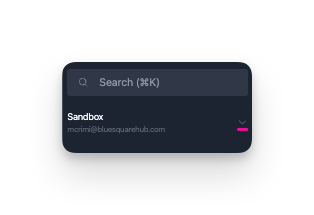
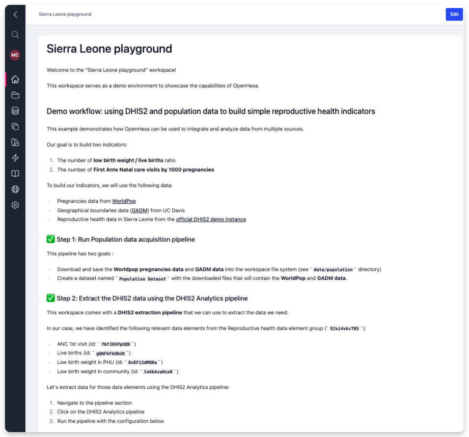
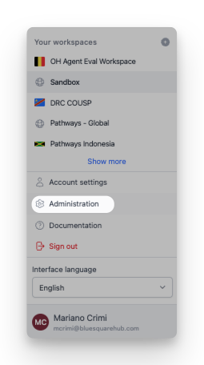
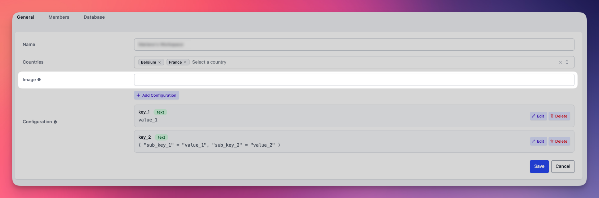
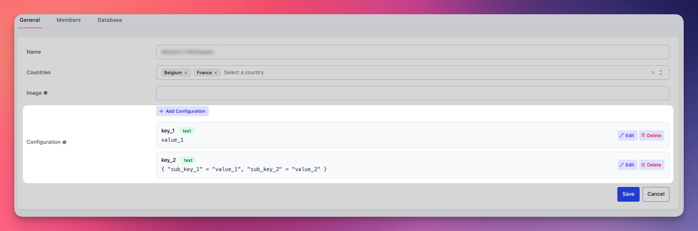

  <h1><i class="fas fa-hexagon" style="margin-right: 0.5rem;"></i>Workspaces</h1>

## Workspace context

When you have access to multiple workspaces, you can easily switch between them using the workspace selector menu in the top-left corner of the screen. This dropdown menu lets you quickly navigate between all workspaces where you have access.

## Create new workspaces

You can create new workspaces if you're:

- **Organization Admin or Owner**: Click the ⊕ button in the workspace selector menu
- **Workspace Admin**: Users who are Admins of at least one existing workspace can also create new workspaces

## Workspace home

You can use the workspace home page to explain the workspace purpose, document the data and processes of the workspace, or add useful links to external resources. 

{ width="70%" }

If you have the **Editor** or  **Admin** role within the workspace, you can change the homepage content by clicking **Edit**. 

## General configuration

If you're a workspace Admin, you can use the **Administration** option to manage your workspace.

In the general configuration, you can change the workspace name and define the associated countries. These settings help identify your workspace across the platform.

### Docker image configuration

All code execution in OpenHEXA (pipelines, notebooks, and more) takes place within Docker containers. Each workspace can specify a custom Docker image that defines the runtime environment, including pre-installed packages and dependencies.

The workspace image setting lets you select which Docker image will be used as the execution environment. The specified image ID will be pulled from Bluesquare's Docker Hub repository.

!!! info "Custom images"
    To request a custom Docker image for your workspace:
    
    1. Contact the OpenHEXA team with your requirements:
       - Email: openhexa@bluesquarehub.com
       - Include details about required packages and dependencies
    2. We'll create and publish an optimized image.
    3. You can then select it in your workspace settings.
    
    In the future, we plan to provide more self-service options for image customization.

!!! tip "Default image"
    If you don't specify a custom image, the workspace uses the standard OpenHEXA image, which includes common data science packages like pandas, numpy, scikit-learn, and more.

### Workspace configuration
As a workspace Admin, you can define configuration properties: **named key-value pairs** that your notebooks and pipelines can read with the OpenHEXA SDK to control runtime behavior (for example, toggling features, setting default parameters, or pointing to external resources). This lets you adapt logic per workspace without changing code.

Typical uses include:

- Feature flags (enable or disable capabilities per workspace)
- Default parameters (for example, default dataset IDs or country codes)
- External URLs or identifiers used by jobs

!!! warning "Use for configuration only"
    Store secrets and credentials in the dedicated [Connections](connections.md) feature rather than in configuration properties.

## Members
### Add or invite members
As a workspace **Admin**, you can invite users to join your workspace. You can invite both existing OpenHEXA users (who may be working in other workspaces) and new users who haven't used the platform before.

To invite users:

- **For existing users**: Search by their name.
- **For new users**: Enter their email address.
- Select their role in the workspace (**Admin**, **Editor**, or **Viewer**).

The invited users will receive an email invitation to join the workspace, which you'll see in the **Pending and Declined Invitations** section. Once they accept, they'll have access according to their assigned role.

### Roles and permissions

A user's role determines what actions they can take within a workspace. Each section of this user manual includes role-specific information to help you understand what actions are available to you.

The following table summarizes the permissions for each role:

| Features | Viewers | Editors | Admins |
|----------|---------|---------|--------|
| Read and download files | ✅ | ✅ | ✅ |
| Write files | ❌ | ✅ | ✅ |
| View database content | ✅ | ✅ | ✅ |
| View database credentials | ❌ | ✅ | ✅ |
| Write to database | ❌ | ✅ | ✅ |
| Regenerate database password | ❌ | ❌ | ✅ |
| Read and download datasets | ✅ | ✅ | ✅ |
| Write datasets | ❌ | ✅ | ✅ |
| Use connections | ❌ | ✅ | ✅ |
| Manage connections | ❌ | ❌ | ✅ |
| Launch pipelines | ✅ | ✅ | ✅ |
| Create pipelines | ❌ | ✅ | ✅ |
| Use notebooks | ❌ | ✅ | ✅ |
| Update workspace description | ❌ | ✅ | ✅ |
| Manage and invite users | ❌ | ❌ | ✅ |

## Database
### Regenerate the workspace database password

When you create a workspace, a **relational database is automatically provisioned** with a username and password.

If the password is compromised, you can invalidate it and create a new one in the settings section.

## Archive
Admins can also archive the workspace. Click **Archive**.