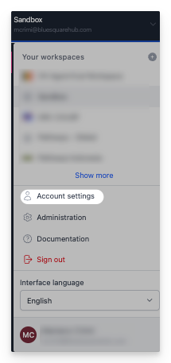

  <h1><i class="fas fa-hexagon" style="margin-right: 0.5rem;"></i>Comptes</h1>

## Créer un compte

### S'inscrire

Si l'auto-inscription est activée sur votre instance OpenHEXA, vous pouvez créer un compte directement depuis la page d'inscription :

1. Accédez à la page **S'inscrire**.
2. Entrez votre adresse e-mail.
3. Cliquez sur **S'inscrire**.
4. Vérifiez votre boîte de réception pour un lien de vérification.
5. Cliquez sur le lien pour terminer votre inscription (le lien expire après 48 heures).

Si vous avez déjà un compte, cliquez sur **Vous avez déjà un compte ? Se connecter** pour accéder à la page de connexion.

!!! info "Disponibilité de l'auto-inscription"
    L'auto-inscription peut ne pas être disponible sur toutes les instances OpenHEXA. Si vous voyez un message indiquant que l'auto-inscription est désactivée, contactez votre administrateur pour demander une invitation.

### Accepter une invitation

Si vous avez reçu une invitation à rejoindre un espace de travail, cliquez sur le lien dans l'e-mail d'invitation pour créer votre compte et accéder à l'espace de travail.

## Gérer votre compte

Vous pouvez gérer vos informations personnelles et vos paramètres de sécurité sur la page **Compte** dans OpenHEXA.

## Informations personnelles

### Mettre à jour votre profil

Vous pouvez consulter et modifier les informations de votre compte dans la section **Détails personnels** :

- **Prénom** : Votre prénom
- **Nom** : Votre nom de famille  
- **E-mail** : Votre adresse e-mail (lecture seule)
- **Inscription** : Date de création de votre compte (lecture seule)

### Enregistrer vos modifications

Après avoir apporté des modifications à vos informations personnelles :

1. Cliquez sur **Enregistrer** pour appliquer vos modifications.
2. Cliquez sur **Annuler** pour annuler les modifications non enregistrées.

## Paramètres de sécurité

### Authentification à deux facteurs (2FA)

L'authentification à deux facteurs ajoute une sécurité supplémentaire à votre compte. Elle nécessite une deuxième forme de vérification en plus de votre mot de passe.

#### Activer la 2FA

1. Dans la section **Sécurité**, trouvez **Authentification à deux facteurs**.
2. Si elle est actuellement désactivée, cliquez sur **Activer**.
3. Suivez les instructions de configuration pour configurer votre méthode 2FA préférée.
4. Terminez le processus de vérification.

!!! info "Avantages de la 2FA"
    - Protège votre compte même si votre mot de passe est compromis
    - Requis pour accéder aux fonctionnalités et données sensibles
    - Aide à maintenir la conformité aux politiques de sécurité

!!! info "Bonnes pratiques"
    - Gardez vos informations personnelles à jour
    - Activez l'authentification à deux facteurs pour une sécurité renforcée
    - Utilisez un mot de passe fort et unique pour votre compte OpenHEXA
    - Examinez régulièrement vos paramètres de sécurité
    - Choisissez votre langue préférée pour une meilleure expérience utilisateur

## Paramètres de langue

Vous pouvez utiliser OpenHEXA en plusieurs langues. Les langues disponibles incluent :

- 🇬🇧 **Anglais** : Langue par défaut
- 🇫🇷 **Français** : Interface en français

### Changer votre langue

Pour changer la langue de l'interface :

1. Trouvez le sélecteur de langue dans le sélecteur d'espace de travail.
2. Sélectionnez votre langue préférée parmi les options disponibles.
3. L'interface se met à jour immédiatement pour s'afficher dans la langue sélectionnée.

