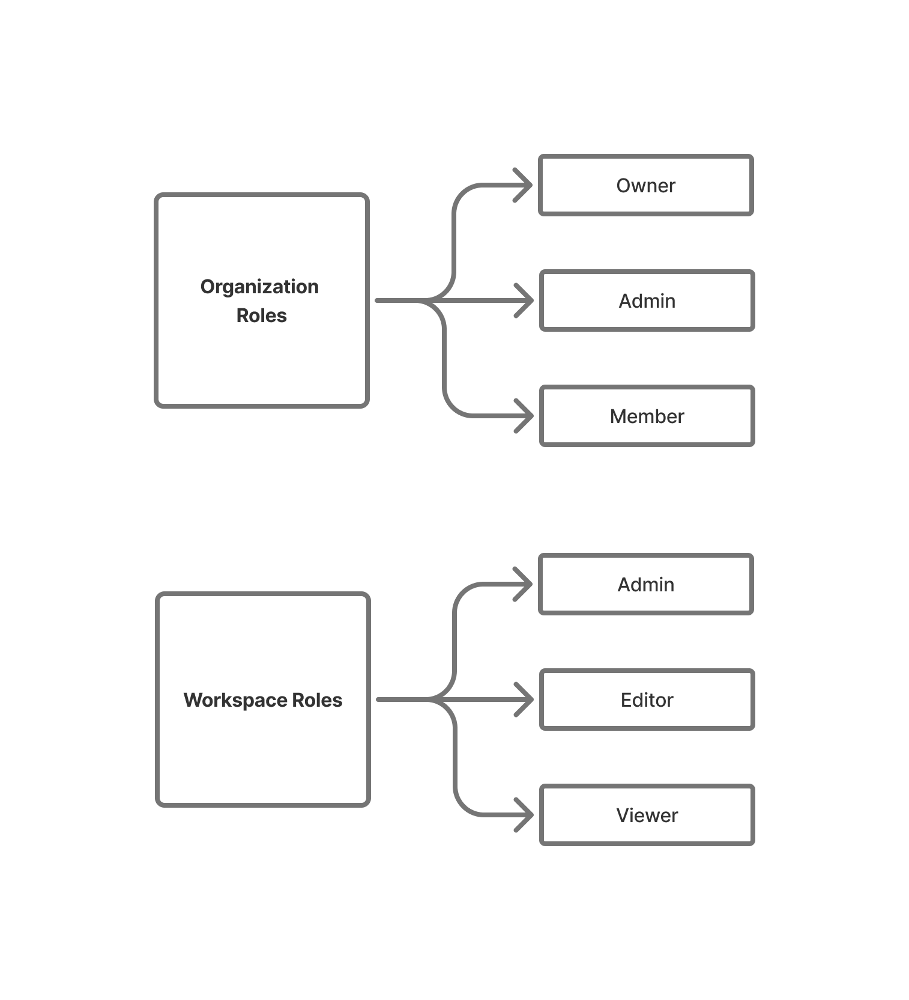

  <h1><i class="fas fa-hexagon" style="margin-right: 0.5rem;"></i>Administration</h1>

## Gestion de l'organisation

OpenHEXA utilise une structure hiérarchique où les organisations contiennent plusieurs espaces de travail. La page d'accueil de l'organisation sert de centre de contrôle pour gérer tous les aspects de votre organisation.

### Page d'accueil de l'organisation

La page d'accueil de l'organisation fournit un aperçu complet et une interface de gestion pour toute votre organisation. 

#### Fonctionnalités clés

- **Espaces de travail** : Voir et gérer tous les espaces de travail de votre organisation
- **Membres** : Voir et gérer tous les utilisateurs de votre organisation
- **Jeux de données** : Accéder à tous les jeux de données de votre organisation depuis un seul endroit

### Rôles au niveau de l'organisation

OpenHEXA a deux rôles au niveau de l'organisation qui fournissent différents niveaux de contrôle administratif :

{ width="50%" }

#### 👤 Admin de l'organisation

Les Admins de l'organisation ont des capacités de gestion complètes sur l'ensemble de l'organisation. Vous pouvez :

- Créer, modifier et supprimer des espaces de travail
- Inviter de nouveaux membres à l'organisation
- Gérer les permissions et les niveaux d'accès des utilisateurs
- Retirer des utilisateurs si nécessaire

Ce rôle est essentiel pour maintenir une structure organisationnelle appropriée et assurer des opérations fluides dans tous les espaces de travail.

#### 👤 Owner

Les Owners ont le plus haut niveau de contrôle sur une organisation. En plus de toutes les capacités d'Admin de l'organisation, vous pouvez :

- Supprimer l'organisation entière et tout son contenu
- Attribuer des rôles d'Admin de l'organisation
- Gérer les détails de facturation et les plans d'abonnement (le cas échéant)

## Changement d'organisation

Pour apprendre comment basculer entre les organisations, consultez [Changement d'organisations](navigation.md#changer-dorganisation) dans le guide de Navigation.

