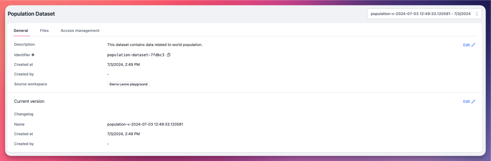
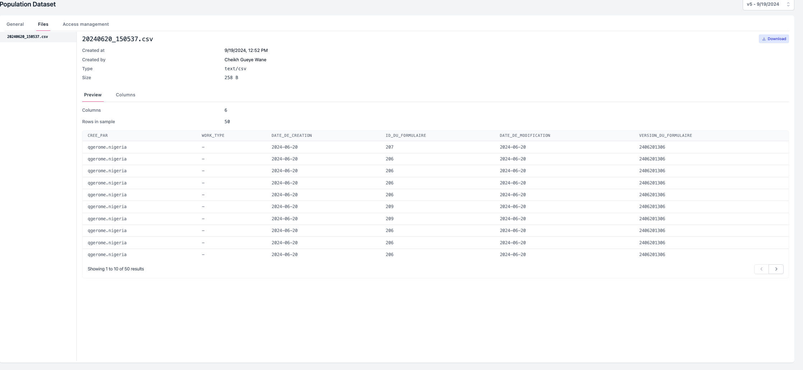
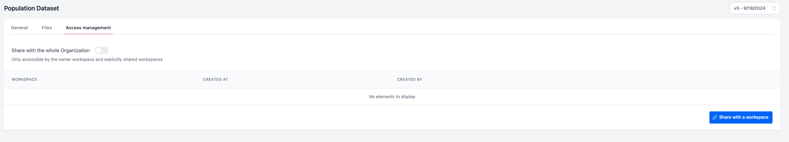

  <h1><i class="fas fa-hexagon" style="margin-right: 0.5rem;"></i>Jeux de données</h1>

Les jeux de données sont une fonctionnalité puissante dans OpenHEXA qui vous aide à gérer, partager et versionner vos actifs de données. Ils servent de dépôts centralisés pour vos données les plus précieuses et fournissent une méthode structurée pour organiser les informations que vous pouvez partager avec des partenaires.

## Avantages clés
Les jeux de données fournissent un moyen centralisé de :

- **Partager et distribuer des données** entre les espaces de travail au sein de votre organisation
- **Stocker des données validées et prêtes pour la production** pour les flux de travail d'analyse
- **Suivre les modifications** avec un versionnement automatique
- **Annoter et documenter** les actifs de données importants

!!! info "Permissions des jeux de données par rôle"
    - **Viewers** : Peuvent parcourir, rechercher, télécharger et consulter les métadonnées des jeux de données
    - **Editors et Admins** : Peuvent parcourir, rechercher, télécharger, consulter les métadonnées, créer des jeux de données et mettre à jour les versions des jeux de données

## Créer un jeu de données

Vous pouvez créer des jeux de données de deux manières :

### Interface web
1. Cliquez sur **Créer** dans la section des jeux de données.
2. Fournissez un nom descriptif pour votre jeu de données.
3. Ajoutez une description détaillée qui explique l'objectif et le contenu du jeu de données.
4. Téléchargez les fichiers qui constitueront la première version de votre jeu de données.

### SDK OpenHEXA
Pour la création programmatique de jeux de données, utilisez le [SDK OpenHEXA](https://github.com/BLSQ/openhexa/wiki/Using-the-OpenHEXA-SDK#working-with-datasets) pour créer et gérer des jeux de données par code.

## Informations générales

La section **Général** fournit des métadonnées essentielles et des options de configuration pour votre jeu de données :

- **Description** : Modifiez la description du jeu de données pour fournir un contexte sur son contenu et son objectif
- **Identifiant (Slug)** : Un identifiant unique que vous pouvez utiliser pour référencer ce jeu de données de manière programmatique avec le [SDK OpenHEXA](https://github.com/BLSQ/openhexa/wiki/Using-the-OpenHEXA-SDK#working-with-datasets)
- **Détails de création** : Voir qui a créé le jeu de données et quand
- **Espace de travail source** : L'espace de travail où le jeu de données a été créé à l'origine (voir [Gestion des accès](#gestion-des-acces) pour les options de partage)

## Gestion des versions

OpenHEXA **suit automatiquement les versions de tous les jeux de données**. Cela fournit un historique complet des modifications et vous permet de surveiller l'évolution de vos données au fil du temps.

### Navigation des versions
- Utilisez le sélecteur de version dans le coin supérieur droit pour basculer entre les différentes versions du jeu de données.
- Chaque version représente un instantané de votre jeu de données à un moment spécifique.

### Détails de la version actuelle
La section **Version actuelle** affiche :

- **Métadonnées de version** : Informations sur la version actuelle, y compris la date de création et l'auteur
- **Changelog** : Notes détaillées sur ce qui a changé dans cette version par rapport aux versions précédentes

## Gestion des fichiers

Les jeux de données peuvent contenir plusieurs fichiers de types variés. Le navigateur de fichiers sur le côté gauche vous permet de naviguer entre différents fichiers au sein de votre jeu de données.

### Types de fichiers pris en charge avec aperçu
OpenHEXA fournit un aperçu en ligne pour les types de fichiers suivants :

|| Catégorie | Types de fichiers |
|----------|------------|
|| Images | `Image/*` (JPEG, PNG, GIF, et plus) |
|| Vidéos | `Video/*` (MP4, AVI, MOV, et plus) |
|| Audio | `Audio/*` (MP3, WAV, et plus) |
|| Documents | `Text/html`, `Text`, `Application/pdf` |
|| Données tabulaires | `CSV`, `XLS`, `XLSX`, `Parquet` |

### Analyse des données tabulaires
Pour les fichiers de données structurées (`CSV`, `XLS`, `XLSX` et `Parquet`), OpenHEXA fournit des capacités d'analyse de profil :

#### Aperçu des données
- Visualisez vos données tabulaires dans un format de tableau interactif
- Triez et filtrez les colonnes pour explorer vos données
- Comprenez rapidement la structure de votre jeu de données

#### Profilage des colonnes
Accédez aux statistiques détaillées pour chaque colonne dans la section **Colonnes** :

- **Qualité des données** : Pourcentage de valeurs manquantes et informations sur le type de données
- **Statistiques numériques** : Moyenne, médiane, écart-type, minimum, maximum et quantiles
- **Distribution des données** : Insights sur la façon dont vos données sont distribuées entre différentes valeurs

### Métadonnées de colonne
Améliorez votre compréhension des données en ajoutant des métadonnées personnalisées aux colonnes :

1. Accédez à la colonne que vous souhaitez annoter.
2. Cliquez sur **Modifier**.
3. Ajoutez des attributs personnalisés en utilisant des paires label-valeur.
4. Fournissez des informations descriptives sur l'objectif et le contenu de la colonne. 
 
## Gestion des accès

Le partage de jeux de données est l'une des fonctionnalités de collaboration les plus puissantes d'OpenHEXA. Il vous permet de distribuer des données dans votre organisation tout en maintenant des contrôles d'accès appropriés.

### Options de partage

#### Partage spécifique à l'espace de travail
- Cliquez sur **Partager avec un espace de travail** pour accorder l'accès à des espaces de travail spécifiques.
- Sélectionnez l'espace de travail cible dans la liste disponible.
- Cette approche fournit un contrôle granulaire sur l'accès aux données.

#### Partage au niveau de l'organisation
- Activez le bouton **Partager avec toute l'organisation**.
- Cela rend le jeu de données disponible à tous les espaces de travail au sein de votre organisation.
- ⚠️ Le partage au niveau de l'organisation remplace toutes les permissions d'espace de travail spécifiques.

### Permissions de partage

!!! info "Permissions des jeux de données partagés"
    Lorsque vous partagez des jeux de données avec d'autres espaces de travail, ils obtiennent un **accès en lecture seule**. L'espace de travail d'origine conserve les droits de modification exclusifs. Cependant, les espaces de travail partagés peuvent :
    
    - Ajouter des annotations de métadonnées aux fichiers tabulaires
    - Mettre à jour les informations du changelog
    - Partager le jeu de données avec des espaces de travail supplémentaires

