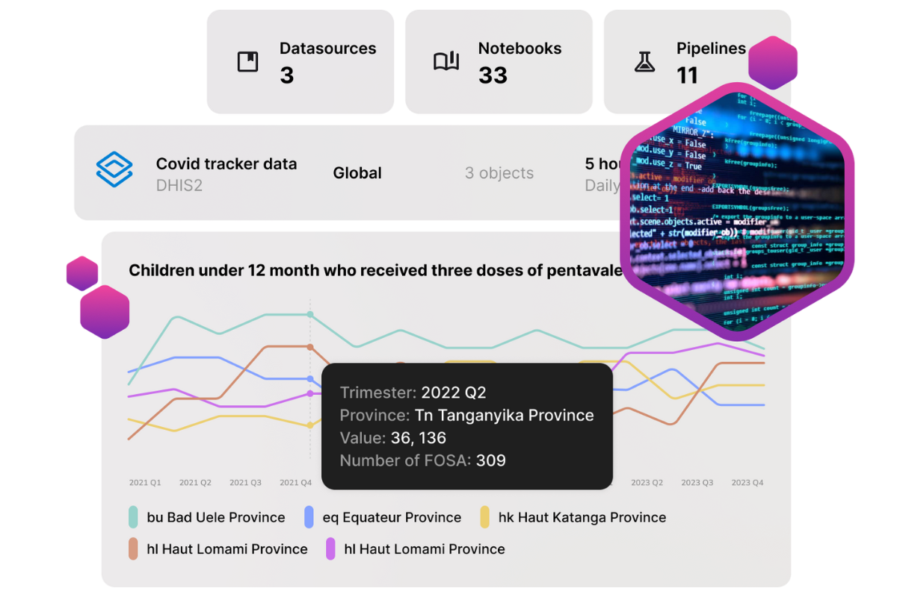

  <h1><i class="fas fa-hexagon" style="margin-right: 0.5rem;"></i>Documentation OpenHEXA</h1>
  
Guide complet de la plateforme d'intégration de données open-source pour les projets de santé publique

  

    <a href="https://openhexa.com" class="hero-btn primary"><i class="fas fa-book" style="margin-right: 0.5rem;"></i>Site Web</a>
    <a href="https://github.com/BLSQ/openhexa" class="hero-btn"><i class="fab fa-github" style="margin-right: 0.5rem;"></i>GitHub</a>
  

## Bienvenue sur OpenHEXA

OpenHEXA est une plateforme d'intégration de données open-source développée par [Bluesquare](https://bluesquarehub.com) pour faciliter l'intégration et l'analyse de données, particulièrement dans le contexte de projets de santé publique.

{ width=70% align=center }

Cette documentation fournit des guides complets pour utiliser OpenHEXA efficacement, de la navigation de base au développement avancé de pipelines.

## Aperçu de la documentation

### 📚 Manuel d'utilisation

Ce manuel d'utilisation couvre tous les aspects de l'utilisation d'OpenHEXA :

  

    
👤

    <h3><a href="account/">Gestion du compte</a></h3>
    
Gérez votre profil, vos paramètres de sécurité et vos préférences personnelles.

  

  
  

    
🧭

    <h3><a href="navigation/">Navigation</a></h3>
    
Apprenez à naviguer entre les organisations, les espaces de travail et à trouver rapidement des ressources.

  

  
  

    
🏢

    <h3><a href="workspaces/">Espaces de travail</a></h3>
    
Créez et gérez des environnements de projet collaboratifs pour votre équipe.

  

  
  

    
📁

    <h3><a href="files/">Gestion des fichiers</a></h3>
    
Téléchargez, organisez et partagez des fichiers via le système de fichiers partagé.

  

  
  

    
🗄️

    <h3><a href="database/">Base de données</a></h3>
    
Travaillez avec des bases de données PostgreSQL pour le stockage et l'analyse de données structurées.

  

  
  

    
📊

    <h3><a href="datasets/">Jeux de données</a></h3>
    
Gérez et versionnez vos jeux de données pour une analyse reproductible.

  

  
  

    
🔗

    <h3><a href="connections/">Connexions</a></h3>
    
Connectez-vous à des sources de données externes et à des API pour l'intégration de données.

  

  
  

    
⚡

    <h3><a href="pipelines/">Pipelines</a></h3>
    
Créez, exécutez et planifiez des flux de travail de données complexes et des processus ETL.

  

  
  

    
📓

    <h3><a href="notebooks/">Notebooks</a></h3>
    
Utilisez les notebooks Jupyter pour l'exploration et l'analyse interactives de données.

  

## Démarrer avec OpenHEXA

### 🚀 Pour les nouveaux utilisateurs

Si vous êtes nouveau sur OpenHEXA, suivez ce parcours d'apprentissage :

1. **[Gestion du compte](account/)** - Configurez votre profil et vos paramètres de sécurité
2. **[Navigation](navigation/)** - Apprenez à naviguer efficacement sur la plateforme
3. **[Espaces de travail](workspaces/)** - Créez votre premier espace de travail et comprenez l'environnement
4. **[Gestion des fichiers](files/)** - Téléchargez et organisez vos fichiers de données
5. **[Notebooks](notebooks/)** - Commencez à explorer les données avec les notebooks Jupyter

### 🛠️ Pour les développeurs

Si vous prévoyez de développer des pipelines ou de travailler avec l'API :

- **[Écrire des pipelines OpenHEXA](https://github.com/BLSQ/openhexa/wiki/Writing-OpenHEXA-pipelines)** - Créez des flux de travail de données personnalisés
- **[Utiliser l'OpenHEXA CLI](https://github.com/BLSQ/openhexa/wiki/Using-the-OpenHEXA-CLI)** - Interface en ligne de commande
- **[Utiliser l'OpenHEXA SDK](https://github.com/BLSQ/openhexa/wiki/Using-the-OpenHEXA-SDK)** - Kit de développement Python
- **[Utiliser l'OpenHEXA Toolbox](https://github.com/BLSQ/openhexa/wiki/Using-the-OpenHEXA-Toolbox)** - Utilitaires de développement
- **[Utiliser les notebooks dans OpenHEXA](https://github.com/BLSQ/openhexa/wiki/Using-notebooks-in-OpenHEXA)** - Utilisation avancée des notebooks

### 👥 Pour les administrateurs

Si vous gérez des équipes et des organisations :

1. **[Administration](admin/)** - Gérez les organisations, les espaces de travail et les utilisateurs
2. **[Espaces de travail](workspaces/)** - Configurez les paramètres et les permissions des espaces de travail

### 🔧 Installation et administration

- **[Instructions d'installation](https://github.com/BLSQ/openhexa/wiki/Installation-instructions)** - Configurez votre instance OpenHEXA
- **[Instructions d'installation locale](https://github.com/BLSQ/openhexa?tab=readme-ov-file#quick-start)** - Configurez votre instance OpenHEXA localement
- **[Architecture technique](https://github.com/BLSQ/openhexa/wiki/Technical-architecture)** - Conception du système et composants

### 🔍 Besoin d'aide ?

- **Discussions GitHub** : [Q&R de la communauté](https://github.com/BLSQ/openhexa/discussions) - Posez des questions et partagez des connaissances
- **Issues GitHub** : [Signaler des bugs et demander des fonctionnalités](https://github.com/BLSQ/openhexa/issues)
- **Documentation** : Vous êtes ici ! 📚 - Guides complets et références

### 🔗 Ressources externes

- **Dépôt GitHub** : [BLSQ/openhexa](https://github.com/BLSQ/openhexa) - Code source et développement
- **Package PyPI** : [openhexa](https://pypi.org/project/openhexa/) - SDK et outils Python
- **Bluesquare** : [Site web de l'entreprise](https://bluesquarehub.com) - En savoir plus sur les développeurs

---

  <h2>Prêt à transformer vos données en insights ?</h2>
  
Rejoignez la communauté croissante d'organisations de santé publique utilisant OpenHEXA pour leurs besoins d'intégration de données.

  

    <a href="https://openhexa.com" class="hero-btn">Visitez www.openhexa.com</a>
  

*OpenHEXA est développé avec ❤️ par [Bluesquare](https://bluesquarehub.com) pour la communauté mondiale de la santé publique.*

