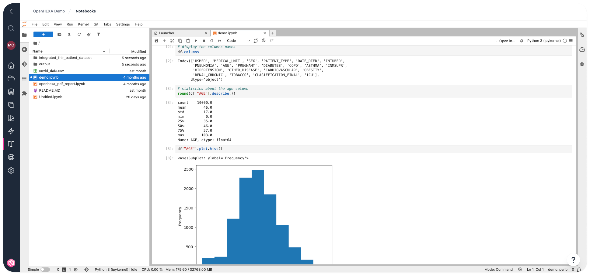

<div class="hero-section">
  <h1><i class="fas fa-hexagon" style="margin-right: 0.5rem;"></i>Notebooks</h1>
</div>
</div>

Le composant notebooks d'OpenHEXA est un déploiement personnalisé de [Jupyter](https://jupyter.org/).

Jupyter est un environnement de développement intégré flexible construit autour de notebooks—des documents qui combinent code, documentation, données et visualisations riches. Il fournit un environnement interactif rapide pour prototyper et expliquer du code, explorer et visualiser des données, et partager des idées avec d'autres. Pour plus d'informations sur la stack Jupyter, consultez la [documentation officielle Jupyter](https://docs.jupyter.org/en/latest/).

!!! info "Permissions des notebooks par rôle"
    - **Viewers** : Ne peuvent pas accéder ni utiliser les notebooks
    - **Editors et Admins** : Peuvent lancer et utiliser l'environnement notebook Jupyter



## Cas d'utilisation

Vous pouvez utiliser les notebooks dans OpenHEXA à diverses fins :

- Explorer et effectuer une analyse préliminaire d'un jeu de données
- Expliquer et illustrer un algorithme ou un modèle de données dans un style de [programmation littéraire](https://en.wikipedia.org/wiki/Literate_programming)
- Prototyper un tableau de bord de visualisation
- Créer un pipeline de données simple

### Quand utiliser des pipelines à la place

Envisagez d'utiliser des [pipelines de données OpenHEXA](https://github.com/BLSQ/openhexa/wiki/User-manual#using-pipelines) à la place lorsque vous voulez :

- Permettre aux utilisateurs non techniques de lancer des flux de travail de traitement de données en utilisant une interface web
- Planifier l'exécution d'un flux de travail de données à des moments spécifiques
- Appliquer des pratiques de développement logiciel standard comme le contrôle de version ou les tests unitaires

## Fonctionnalités des notebooks OpenHEXA

Le composant notebooks d'OpenHEXA fonctionne comme un environnement Jupyter standard, avec quelques ajouts utiles :

- De nombreuses bibliothèques pré-installées
- Accès au système de fichiers de l'espace de travail partagé dans le navigateur de fichiers Jupyter
- Identifiants de base de données de l'espace de travail automatiquement exposés comme variables d'environnement

Ce guide vous accompagne à travers les spécificités de l'environnement notebooks d'OpenHEXA. Vous pourriez également trouver ces guides utiles :

- [Utiliser l'OpenHEXA SDK](https://github.com/BLSQ/openhexa/wiki/Using-the-OpenHEXA-SDK) : Le SDK OpenHEXA est une bibliothèque Python qui fournit des blocs de construction et des méthodes d'aide pour écrire du code sur OpenHEXA
- [Utiliser l'OpenHEXA Toolbox](https://github.com/BLSQ/openhexa/wiki/Using-the-OpenHEXA-Toolbox) : L'OpenHEXA Toolbox est une collection d'utilitaires qui peuvent vous aider avec l'intégration et l'analyse de données de santé

## Fonctionnalités clés de JupyterLab

JupyterLab fournit une interface puissante pour le travail de data science. Voici quelques-unes des fonctionnalités les plus importantes que vous utiliserez :

### Navigateur de fichiers et navigation

La barre latérale gauche a un navigateur de fichiers qui vous donne accès à vos fichiers d'espace de travail. Vous pouvez :
- Naviguer dans les répertoires en cliquant sur les noms de dossiers
- Créer de nouveaux fichiers et dossiers en utilisant le bouton **+**
- Télécharger des fichiers en les faisant glisser et en les déposant dans le navigateur
- Cliquer avec le bouton droit sur les fichiers pour accéder aux menus contextuels pour renommer, supprimer ou télécharger

### Types de cellules et exécution

Les notebooks sont composés de cellules qui peuvent contenir différents types de contenu :
- **Cellules de code** : Exécuter Python, R ou d'autres langages de programmation
- **Cellules Markdown** : Écrire du texte formaté, de la documentation et des explications
- **Cellules brutes** : Texte brut qui ne sera pas traité

Utilisez `Shift + Entrée` pour exécuter une cellule et passer à la suivante, ou `Ctrl + Entrée` pour exécuter sans se déplacer.

### Inspecteur de variables

L'inspecteur de variables (accessible depuis la barre latérale gauche) affiche toutes les variables actuellement en mémoire, leurs types et leurs valeurs. Ceci est particulièrement utile pour :
- Déboguer votre code
- Comprendre les structures de données
- Surveiller l'utilisation de la mémoire
- Explorer les jeux de données de manière interactive

### Palette de commandes

Appuyez sur `Ctrl + Maj + C` (ou `Cmd + Maj + C` sur Mac) pour ouvrir la palette de commandes, qui fournit un accès rapide à :
- Toutes les commandes et raccourcis disponibles
- Opérations sur les fichiers
- Opérations sur les cellules
- Fonctionnalités des extensions

### Vue fractionnée et onglets

JupyterLab prend en charge plusieurs vues de votre travail :
- **Vue fractionnée** : Faites glisser les onglets pour créer des dispositions côte à côte ou empilées
- **Onglets multiples** : Ouvrez plusieurs notebooks ou fichiers en même temps
- **Gestion des onglets** : Cliquez avec le bouton droit sur les onglets pour des options comme **Fermer tout** ou **Fermer les autres**

### Raccourcis clavier

Raccourcis essentiels pour un travail efficace :
- `A` / `B` : Insérer une cellule au-dessus ou en dessous
- `DD` : Supprimer la cellule
- `M` / `Y` : Changer la cellule en Markdown ou Code
- `Shift + M` : Fusionner les cellules
- `Ctrl + S` / `Cmd + S` : Enregistrer le notebook
- `Z` : Annuler la suppression de cellule

## Utiliser le système de fichiers de l'espace de travail

Lorsque vous lancez l'environnement notebooks, vous verrez que le système de fichiers Jupyter affiche deux répertoires :

1. Le répertoire `tmp`
2. Le répertoire `workspace`

Vous ne pouvez écrire des données que dans ces deux répertoires. **Vous ne pouvez pas créer de fichiers ou de répertoires à la racine** du système de fichiers.

Pour plus d'informations sur les répertoires `workspace` et `tmp` et comment les utiliser avec Python, consultez la [documentation SDK](https://github.com/BLSQ/openhexa/wiki/Using-the-OpenHEXA-SDK#reading-and-writing-files). Pour les utilisateurs de R, voir l'exemple de code ci-dessous (nous n'avons pas encore de SDK pour R).

https://github.com/BLSQ/openhexa/assets/690667/8f279c1f-c371-490f-a04f-84a97b028859

Voici un exemple de base montrant comment lire/écrire des données dans le système de fichiers de l'espace de travail en Python :

```python
import pandas as pd
from openhexa.sdk import workspace

# Lire des données
df = pd.read_csv(f"{workspace.files_path}/covid_data.csv")

# Écrire des données
df = pd.DataFrame({"foo": [1, 2, 3], "bar": [4, 5, 6]})
df.to_csv(f"{workspace.files_path}/foobar.csv")
```

L'exemple équivalent en R (jusqu'à ce que nous ayons un SDK pour R, vous devrez coder en dur le chemin du répertoire de l'espace de travail) :

```r
# Lire des données
df <- read.csv("/home/hexa/workspace/covid_data.csv")

# Écrire des données
x          <- 1:10
y          <- letters[1:10]
some_data <- tibble::tibble(x, y)
write.csv(some_data, "foobar.csv")
```

https://github.com/BLSQ/openhexa/assets/690667/49e53c15-c251-4283-9450-94ae9bdff9b6

## Utiliser la base de données de l'espace de travail

La base de données de l'espace de travail est une base de données [PostgreSQL](https://www.postgresql.org/) standard. Vous pouvez utiliser n'importe quelle bibliothèque prenant en charge PostgreSQL pour y accéder dans un notebook.

Si vous utilisez Python, la méthode recommandée pour obtenir les identifiants de la base de données est d'utiliser le [SDK OpenHEXA](https://github.com/BLSQ/openhexa/wiki/Using-the-OpenHEXA-SDK#using-the-workspace-database).

Voici un exemple Python minimal (avec [SQLAlchemy](https://www.sqlalchemy.org/)) pour vous lancer :

```python
import pandas as pd
from sqlalchemy import create_engine, Integer
from openhexa.sdk import workspace

# Créer un moteur SQLAlchemy
engine = create_engine(workspace.database_url)

# Lire des données
pd.read_sql("SELECT * FROM covid_data", con=engine)

# Écrire des données
df = pd.DataFrame({"foo": [1, 2, 3], "bar": [4, 5, 6]})
df.to_sql("a_new_table", con=engine, if_exists="replace", index_label="id", 
          chunksize=100, dtype={"id": Integer(), "foo": Integer(), "bar": Integer()})
pd.read_sql("SELECT * FROM a_new_table", con=engine)
```

Notez que nous utilisons les arguments optionnels `chunksize` et `dtype`. Utilisez `chunksize` pour contrôler le nombre de lignes écrites dans chaque lot (pour optimiser l'utilisation de la mémoire), et utilisez `dtype` pour spécifier explicitement les types de colonnes PostgreSQL et éviter les problèmes de conversion causés par le comportement de devinette de type par défaut.

Comme nous n'avons pas encore de SDK pour R, vous devrez utiliser des variables d'environnement pour obtenir les identifiants de la base de données lors de l'utilisation de R.

Voici comment vous pouvez le faire en utilisant [DBI](https://dbi.r-dbi.org/) :

```r
# Connexion initiale
library(DBI)
con <- dbConnect(
    RPostgres::Postgres(),
    dbname = Sys.getenv("WORKSPACE_DATABASE_DB_NAME"),
    host = Sys.getenv("WORKSPACE_DATABASE_HOST"),
    port = Sys.getenv("WORKSPACE_DATABASE_PORT"),
    user = Sys.getenv("WORKSPACE_DATABASE_USERNAME"),
    password = Sys.getenv("WORKSPACE_DATABASE_PASSWORD")
)

# Écrire des données
x          <- 1:10
y          <- letters[1:10]
some_data <- tibble::tibble(x, y)
dbWriteTable(con, "another_table", some_data, overwrite=TRUE)
df <- dbReadTable(con, "another_table")
```

## Utiliser les connexions

Une fois que vous avez ajouté une nouvelle [connexion](https://github.com/BLSQ/openhexa/wiki/User-manual#adding-and-managing-connections), vous pouvez accéder à ses paramètres dans votre environnement Jupyter via le SDK.

Pour plus d'informations sur l'utilisation des connexions en Python, consultez la [documentation du SDK OpenHEXA](https://github.com/BLSQ/openhexa/wiki/Using-the-OpenHEXA-SDK#using-connections). Pour des informations générales sur les connexions, consultez le [Manuel d'utilisation](https://github.com/BLSQ/openhexa/wiki/User-manual#adding-and-managing-connections).


Voici comment vous pouvez accéder aux paramètres de connexion en utilisant Python :

```python
import os
from openhexa.sdk import workspace

print(workspace.get_connection("connection-identifier"))
```

## Redémarrer votre serveur Jupyter

Vous pourriez avoir besoin de redémarrer votre serveur Jupyter dans quelques situations, telles que :

- Votre serveur est complètement bloqué et le redémarrer est votre dernière option

Malheureusement, redémarrer votre serveur Jupyter n'est pas simple pour le moment. Nous améliorerons cela à l'avenir.

Pour l'instant, vous devez :

1. Ouvrir le panneau de contrôle JupyterHub (**Fichier** > **Panneau de contrôle Hub**—cela s'ouvre dans une nouvelle fenêtre ou un nouvel onglet).
2. Trouvez votre serveur dans la liste des serveurs en cours d'exécution. Chaque serveur de la liste correspond à un espace de travail. Le serveur que vous recherchez est dans l'état "en cours d'exécution", et son nom devrait correspondre à l'URL dans la barre d'adresse de votre navigateur.
3. Cliquez sur **arrêter**.
4. Fermez l'onglet du panneau de contrôle Hub, retournez à l'écran des notebooks OpenHEXA et rechargez la page.


## Conseils et astuces

Cette section contient quelques recettes que vous pourriez trouver utiles.

### Utiliser s3fs pour interagir avec un bucket S3

Si vous avez besoin de parcourir, télécharger ou téléverser des données dans un bucket Amazon S3, ajoutez d'abord une [connexion](https://github.com/BLSQ/openhexa/wiki/User-manual#adding-and-managing-connections) AWS S3.

Une fois que vous avez ajouté la connexion, vous pouvez interagir avec le bucket dans un notebook Jupyter.

Bien que votre environnement Jupyter OpenHEXA soit livré avec [boto3](https://github.com/boto/boto3) pré-installé, [s3fs](https://github.com/fsspec/s3fs) est plus facile pour la plupart des opérations (`s3fs` est également pré-installé dans votre environnement).

Voici un exemple de base montrant comment utiliser `s3fs` dans un notebook OpenHEXA :

```python
import os
import s3fs

# Les noms de variables d'environnement peuvent être copiés-collés depuis la page de détails de la connexion
fs = s3fs.S3FileSystem(key=os.environ["BUCKET_CONNECTION_ACCESS_KEY_ID"], secret=os.environ["BUCKET_CONNECTION_ACCESS_KEY_SECRET"])
bucket_name = os.environ["BUCKET_CONNECTION_BUCKET_NAME"]

# Lister les fichiers dans un répertoire du bucket
fs.ls(f"{bucket_name}/data/climate")

# Télécharger tous les fichiers du répertoire du bucket dans le système de fichiers de l'espace de travail
fs.get(f"{bucket_name}/data/climate", "/home/hexa/workspace/climate_data", recursive=True)
```

### Utiliser gcsfs pour interagir avec un bucket Google Cloud Storage

Si vous avez besoin de parcourir, télécharger ou téléverser des données dans un bucket Google Cloud Storage, ajoutez d'abord une [connexion](https://github.com/BLSQ/openhexa/wiki/User-manual#adding-and-managing-connections) GCS.

Une fois que vous avez ajouté la connexion, vous pouvez interagir avec le bucket dans un notebook Jupyter.

La façon la plus simple d'interagir avec GCS est d'utiliser [gcsfs](https://github.com/fsspec/gcsfs) (`gcsfs` est pré-installé dans votre environnement).

Voici un exemple de base montrant comment utiliser `gcsfs` dans un notebook OpenHEXA :

```python
import gcsfs
import os
import json

# Les noms de variables d'environnement peuvent être copiés-collés depuis la page de détails de la connexion
gcsfs_service_account_key = json.loads(os.environ["BUCKET_CONNECTION_SERVICE_ACCOUNT_KEY"])
fs = gcsfs.GCSFileSystem(token=gcsfs_service_account_key)
bucket_name = os.environ["BUCKET_CONNECTION_BUCKET_NAME"]

# Lister les fichiers dans un répertoire du bucket
fs.ls(f"{bucket_name}/data/population")

# Télécharger tous les fichiers du répertoire du bucket dans le système de fichiers de l'espace de travail
fs.get(f"{bucket_name}/data/population", "/home/hexa/workspace/population_data", recursive=True)
```

