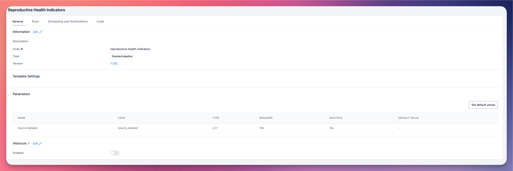
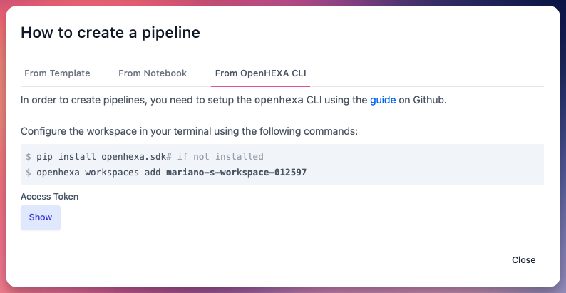
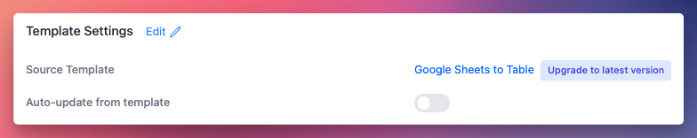
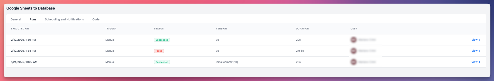
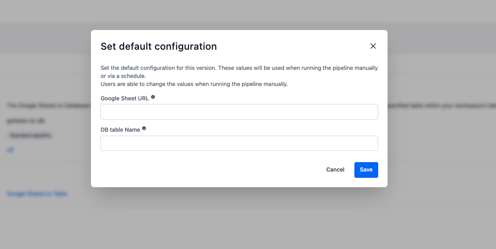

<div class="hero-section">
  <h1><i class="fas fa-hexagon" style="margin-right: 0.5rem;"></i>Pipelines</h1>
</div>
</div>

Les pipelines sont le moteur d'automatisation principal d'OpenHEXA. Ils vous permettent de créer des flux de travail de données sophistiqués qui peuvent traiter, transformer et analyser automatiquement les informations. Considérez les pipelines comme des applications de données programmables qui exécutent des tâches complexes avec une intervention humaine minimale.

## Qu'est-ce que les pipelines ?

Les pipelines OpenHEXA sont des applications de données basées sur Python conçues pour gérer un large éventail de scénarios de traitement de données :

- **Traitement de données et ETL** : Extraire, transformer et charger des données de diverses sources dans votre environnement d'analyse
- **Génération de rapports** : Créer automatiquement des rapports PDF, des documents Microsoft Word et d'autres sorties basés sur vos données
- **Intégration de systèmes** : Connecter différents systèmes de données en récupérant, transformant et transmettant des données entre les plateformes
- **Analyse de données** : Effectuer des tâches analytiques complexes et générer des insights à partir de vos jeux de données
- **Automatisation des flux de travail** : Orchestrer des processus en plusieurs étapes qui nécessiteraient autrement une intervention manuelle



Les pipelines sont écrits comme des programmes Python, vous donnant un contrôle complet sur leur comportement et leurs fonctionnalités. Pour des conseils de développement détaillés, consultez notre [guide dédié au développement de pipelines](https://github.com/BLSQ/openhexa/wiki/Writing-OpenHEXA-pipelines).

## Exécuter et surveiller les pipelines

Une fois qu'un pipeline est déployé dans un espace de travail, tous les membres de l'espace de travail peuvent l'exécuter.

!!! info "Permissions des pipelines par rôle"
    - **Viewers** : Peuvent lancer des pipelines et voir les exécutions et sorties des pipelines
    - **Editors** : Peuvent lancer des pipelines, voir les exécutions et sorties, et créer de nouveaux pipelines
    - **Admins** : Peuvent lancer des pipelines, voir les exécutions et sorties, créer de nouveaux pipelines et gérer les paramètres des pipelines

### Exécution manuelle

1. **Sélectionner un pipeline** : Accédez à la section **Pipelines** dans votre espace de travail.
2. **Cliquer sur Exécuter** : Cliquez sur le bouton **Exécuter** pour démarrer l'exécution du pipeline.
3. **Configurer les paramètres** : Entrez tous les paramètres requis pour l'exécution actuelle.


!!! info "Paramètres avancés"
    Lorsque vous exécutez un pipeline manuellement, vous pouvez configurer deux paramètres avancés :

    - **Envoyer des notifications** : Activé par défaut. Ce paramètre contrôle si les notifications sont envoyées selon la configuration de notification de votre espace de travail.
    - **Afficher les messages de débogage** : Désactivé par défaut. Lorsqu'il est activé, ce paramètre affiche des messages de débogage détaillés enregistrés avec la méthode SDK `current_run.log_info()`.


Pendant l'exécution de votre pipeline, vous pouvez surveiller sa progression en temps réel :

- **Mises à jour de statut** : Indicateurs de statut en temps réel montrant l'état d'exécution actuel
- **Messages de progression** : Messages de retour (`INFO`, `DEBUG`, `WARNING`, `ERROR`, `CRITICAL`) du développeur du pipeline
- **Sortie de journal** : Informations de journalisation d'erreurs complètes

### Accéder aux résultats de sortie

Une fois qu'une exécution de pipeline se termine avec succès, vous pouvez accéder à ses sorties dans les détails de l'exécution :

- **Jeux de données générés** : Accédez aux versions de jeux de données créées par le pipeline
- **Fichiers générés** : Téléchargez ou visualisez les fichiers créés par le pipeline
- **Base de données** : Accédez aux données écrites dans votre base de données d'espace de travail


## Créer des pipelines

OpenHEXA fournit plusieurs approches pour créer des pipelines, chacune adaptée à différents cas d'utilisation et niveaux de compétence.

### Méthodes de création

#### 1. Utiliser l'OpenHEXA CLI
Pour les développeurs et les ingénieurs de données, le CLI fournit l'approche la plus flexible :
- Contrôle complet sur la structure, les paramètres et la configuration du pipeline
- Intégration avec GitHub pour le contrôle de version
- Fonctionnalités de développement avancées



Voir nos guides : [Utiliser l'OpenHEXA CLI](https://github.com/BLSQ/openhexa/wiki/Using-the-OpenHEXA-CLI) et [Écrire des pipelines OpenHEXA](https://github.com/BLSQ/openhexa/wiki/Writing-OpenHEXA-pipelines).

#### 2. À partir d'un notebook Jupyter
Vous pouvez utiliser un Notebook du système de fichiers de l'espace de travail pour être exécuté comme un pipeline. C'est la façon la plus simple de créer un pipeline :
- **Démarrage rapide** : Transformez l'analyse exploratoire en flux de travail de production
- **Limitations** : Les pipelines basés sur des notebooks ne prennent pas en charge les paramètres d'entrée


!!! warning "Limitations des pipelines basés sur des notebooks"
     Gardez à l'esprit que les pipelines basés sur des notebooks ne sont pas versionnés, ne peuvent pas accepter de paramètres et si un utilisateur modifie le notebook, le pipeline sera mis à jour.

#### 3. À partir de modèles de pipelines
Cette option vous permet d'utiliser des pipelines pré-construits et développés professionnellement pour des cas d'utilisation courants :

**Méthode 1 : Depuis la page Créer des pipelines**

1. Accédez à la section **Pipelines**.
2. Cliquez sur **Créer**.
3. Sélectionnez **À partir d'un modèle**.
4. Choisissez votre modèle et cliquez sur **Créer un pipeline**.


**Méthode 2 : Depuis la page Modèles disponibles**

1. Accédez à **Modèles disponibles**.
2. Sélectionnez votre modèle souhaité.
3. Cliquez sur **Créer un pipeline**.


## Bibliothèque de modèles de pipelines

La bibliothèque de modèles d'OpenHEXA comprend des pipelines officiels développés par Bluesquare et des organisations partenaires, spécifiquement conçus pour répondre aux défis courants d'intégration de données en santé publique et en analyse.

### Explorer les modèles
1. Accédez à **Modèles disponibles** dans votre espace de travail.
2. Parcourez le catalogue des modèles de pipelines disponibles.
3. Cliquez sur n'importe quel modèle pour explorer sa documentation, son code et ses capacités.


### Mises à jour des modèles
Lorsque vous créez un pipeline à partir d'un modèle, OpenHEXA maintient une connexion entre votre pipeline et le modèle source. Cela permet les mises à niveau de modèle lorsque de nouvelles versions sont disponibles.




Vous pouvez choisir entre deux méthodes de mise à niveau lors de la création d'un pipeline basé sur un modèle :

- **Manuel (par défaut)** : Vous contrôlez quand mettre à niveau. Laissez "Mise à jour automatique depuis le modèle" désactivé.

    - Recevez des notifications sur les nouvelles versions
    - Examinez les modifications entre les versions
    - Mettez à niveau en utilisant le bouton "Mettre à niveau vers la dernière version"

- **Automatique** : Le pipeline se met à jour automatiquement lorsque le modèle change. Activez "Mise à jour automatique depuis le modèle".

    - Aucune intervention manuelle nécessaire
    - Le pipeline reste synchronisé avec le modèle automatiquement


### Publier des modèles de pipelines

Les créateurs de pipelines peuvent publier leurs propres modèles de pipelines pour les partager avec d'autres utilisateurs et espaces de travail.

1. **Développer votre pipeline** : Créez et testez votre pipeline en utilisant les pratiques de développement standard.
2. **Préparer la documentation** : Assurez-vous que votre pipeline dispose d'une documentation complète et de descriptions claires des paramètres.
3. **Publier** : Lorsque vous êtes satisfait, cliquez sur **Publier le modèle** (ou **Publier une nouvelle version du modèle** si vous publiez une nouvelle version d'un modèle existant). N'oubliez pas d'ajouter un changelog décrivant les modifications que vous apportez.


## Webhooks

Vous pouvez déclencher des pipelines depuis des applications externes en utilisant des points de terminaison webhook. Cela permet une intégration transparente avec des systèmes tiers et des flux de travail automatisés.

Cliquez sur **Modifier** dans la section **Webhook**, et activez le bouton **Activé**.


### Configuration du webhook
- **URL du point de terminaison** : Chaque pipeline a une URL webhook unique pour l'accès externe
- **Support des paramètres** : Les webhooks peuvent accepter des paramètres pour personnaliser le comportement du pipeline

### Exemple d'utilisation
```bash
curl -X POST \
  -H "Content-Type: application/json" \
  -d '{"parameter_1":"1","org_unit_id":14, "sheet_id":"id-sheet"}' \
  https://api.openhexa.org/pipelines/{pipeline_id}/run
```

## Exécutions de pipelines

- **Historique d'exécution** : Voir tous les pipelines précédents. Cliquez sur **Voir** pour les journaux détaillés et les résultats d'une exécution spécifique.
- **Suivi du statut** : Surveillez le statut de l'exécution (en attente, en cours, terminé ou échoué)




## Planification et notifications

Vous pouvez planifier des pipelines pour qu'ils s'exécutent automatiquement à intervalles spécifiés, permettant des flux de travail de traitement de données sans intervention.


### Configurer les planifications
1. Accédez à la page de détails de votre pipeline.
2. Ouvrez la section **Planification et notifications**.
3. Configurez votre planification en utilisant des [expressions cron](https://en.wikipedia.org/wiki/Cron). Utilisez [crontab.guru](https://crontab.guru/) si vous avez besoin d'aide sur la syntaxe.

!!! info "Modèles de planification courants"

    - `0 0 * * *` - Exécuter quotidiennement à minuit
    - `0 0 * * MON` - Exécuter tous les lundis à minuit
    - `0 0 1 * *` - Exécuter le premier jour de chaque mois à minuit
    - `0 */6 * * *` - Exécuter toutes les 6 heures
    - `*/15 * * * *` - Exécuter toutes les 15 minutes

### Configuration des notifications
- **Destinataires** : Choisissez quels membres de l'espace de travail recevront des notifications. Vous pouvez ajouter autant de collègues que vous le souhaitez.
- **Niveau** : Sélectionnez le niveau auquel la notification sera déclenchée pour la personne : **Tous** pour envoyer des notifications à chaque exécution, ou **Erreur** pour les notifications uniquement en cas d'erreur.

### Configuration par défaut
Définissez les valeurs de paramètres par défaut qui seront utilisées pour les exécutions planifiées.




!!! warning "La configuration par défaut est obligatoire pour la planification"
    Vous devez configurer les paramètres par défaut pour planifier l'exécution automatique de votre pipeline. Assurez-vous de les définir avant d'essayer de planifier.


!!! info "Délais d'expiration des pipelines"
    Tous les pipelines ont des limites de temps d'exécution pour éviter l'épuisement des ressources :

    - **Délai standard** : 4 heures (configuration par défaut)
    - **Délai maximum** : 12 heures (configurable par les auteurs de pipelines)
    - **Délais personnalisés** : Les développeurs de pipelines peuvent [configurer des délais personnalisés](https://github.com/BLSQ/openhexa/wiki/Writing-OpenHEXA-pipelines#pipeline-timeouts) dans la limite maximale

### Accès au code source

- **Voir et modifier le code** : Parcourez et modifiez le code source du pipeline directement dans l'interface web
- **Télécharger** : Exportez le code du pipeline pour le développement local ou la sauvegarde


