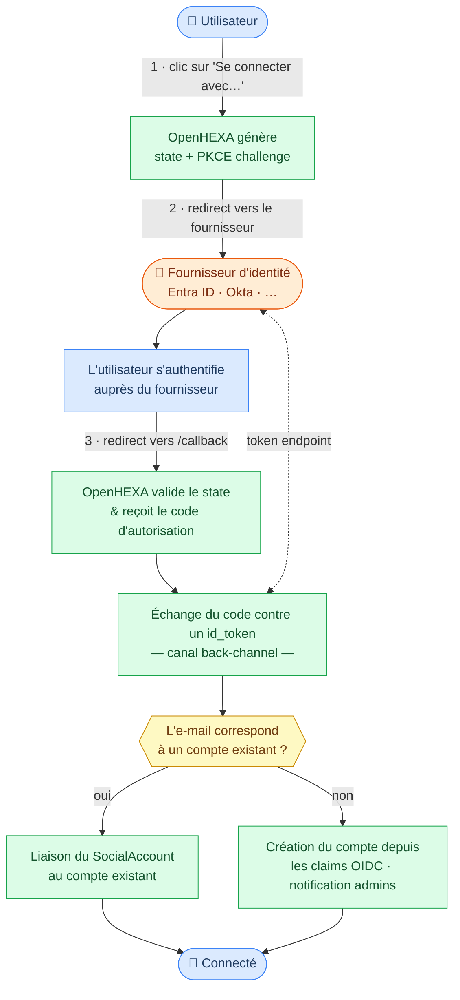

<div class="hero-section">
  <h1><i class="fas fa-hexagon" style="margin-right: 0.5rem;"></i>Authentification unique (SSO)</h1>
</div>
</div>

OpenHEXA prend en charge la connexion externe via n'importe quel fournisseur d'identité **OpenID Connect (OIDC)** — notamment Microsoft Entra ID (Azure AD), Google, Okta et des services similaires. Lorsqu'au moins un fournisseur est configuré, un bouton de connexion correspondant apparaît sur la page de connexion. Les utilisateurs sont provisionnés automatiquement à leur première connexion ; les utilisateurs existants sont liés par adresse e-mail.

## Fonctionnement



Le flux de connexion utilise le grant Authorization Code avec PKCE :

1. L'utilisateur clique sur le bouton **Se connecter avec &lt;Fournisseur&gt;**.
2. Le navigateur est redirigé vers le point de terminaison d'autorisation du fournisseur d'identité.
3. Après l'authentification, le fournisseur redirige vers `/accounts/oidc/{provider_id}/login/callback/`.
4. OpenHEXA valide le paramètre `state` et échange le code contre des tokens.
5. La claim d'e-mail de l'utilisateur est utilisée pour trouver ou créer un compte OpenHEXA.

!!! info "Connexion par mot de passe"
    Lorsqu'un fournisseur OIDC est configuré, le formulaire de connexion par mot de passe est automatiquement masqué. C'est intentionnel pour les déploiements où tous les utilisateurs doivent s'authentifier via le fournisseur d'identité. L'activation simultanée des deux méthodes n'est pas prise en charge.

## Configurer un fournisseur

Définissez les variables d'environnement suivantes dans votre déploiement :

| Variable | Obligatoire | Description |
|---|---|---|
| `OIDC_PROVIDERS` | Oui | Liste de fournisseurs séparés par des virgules, par exemple `who` ou `who,wfp`. |
| `OIDC_{ID}_CLIENT_ID` | Oui | Identifiant client OAuth2 fourni par le fournisseur d'identité. |
| `OIDC_{ID}_SERVER_URL` | Oui | URL de base de découverte OIDC. OpenHEXA récupère automatiquement `{SERVER_URL}/.well-known/openid-configuration` pour découvrir tous les points de terminaison. |
| `OIDC_{ID}_CLIENT_SECRET` | Non | Secret client OAuth2. Requis pour les clients confidentiels. |
| `OIDC_{ID}_DISPLAY_NAME` | Non | Libellé affiché sur le bouton de connexion. Par défaut, l'identifiant du fournisseur en majuscules. |
| `OIDC_{ID}_NEW_ACCOUNT_EMAIL_RECIPIENTS` | Non | Liste d'adresses e-mail d'administrateurs à notifier lorsqu'un nouveau compte OpenHEXA est créé automatiquement via ce fournisseur. |

**Convention de nommage :** Remplacez `{ID}` par l'identifiant du fournisseur en majuscules. Les tirets dans les identifiants sont remplacés par des underscores, ainsi le fournisseur `who-ciam` utilise `OIDC_WHO_CIAM_CLIENT_ID`.

### Exemple avec un seul fournisseur

```bash
OIDC_PROVIDERS=who
OIDC_WHO_CLIENT_ID=votre-client-id
OIDC_WHO_CLIENT_SECRET=votre-client-secret
OIDC_WHO_SERVER_URL=https://login.microsoftonline.com/{TENANT_ID}/v2.0
OIDC_WHO_DISPLAY_NAME=WHO
OIDC_WHO_NEW_ACCOUNT_EMAIL_RECIPIENTS=admin@example.org,ops@example.org
```

### Exemple avec plusieurs fournisseurs

```bash
OIDC_PROVIDERS=who,wfp
OIDC_WHO_CLIENT_ID=...
OIDC_WHO_CLIENT_SECRET=...
OIDC_WHO_SERVER_URL=https://login.microsoftonline.com/{WHO_TENANT_ID}/v2.0
OIDC_WHO_DISPLAY_NAME=WHO

OIDC_WFP_CLIENT_ID=...
OIDC_WFP_CLIENT_SECRET=...
OIDC_WFP_SERVER_URL=https://login.microsoftonline.com/{WFP_TENANT_ID}/v2.0
OIDC_WFP_DISPLAY_NAME=WFP
```

## Microsoft Entra ID (Azure AD)

WHO CIAM et de nombreux autres fournisseurs d'identité d'entreprise fonctionnent sur Microsoft Entra ID. La configuration nécessite l'enregistrement d'OpenHEXA en tant qu'application dans votre tenant Azure.

### Enregistrement de l'application Azure

1. Dans le [portail Azure](https://portal.azure.com), accédez à **Azure Active Directory → Inscriptions d'applications → Nouvelle inscription**.
2. Définissez l'URI de redirection sur `https://{votre-domaine}/accounts/oidc/{provider_id}/login/callback/` (type : **Web**).
3. Sous **Certificats et secrets**, créez un nouveau secret client et notez sa valeur.
4. Notez l'**ID d'application (client)** et l'**ID de répertoire (tenant)** depuis la page de présentation de l'application.

### Scopes requis

OpenHEXA demande `openid profile email`. Assurez-vous que ces scopes sont accordés dans l'enregistrement de l'application Azure sous **Autorisations d'API**. Les claims `email` et `profile` doivent être incluses dans le token d'identité — vérifiez cela sous **Configuration des tokens**.

### Variables d'environnement

```bash
OIDC_{ID}_SERVER_URL=https://login.microsoftonline.com/{TENANT_ID}/v2.0
```

Le document de découverte d'Entra ID est disponible à `{SERVER_URL}/.well-known/openid-configuration`, qu'OpenHEXA récupère automatiquement.

!!! info "Claim email_verified"
    Entra ID omet souvent la claim `email_verified`. OpenHEXA traite une claim absente comme vérifiée, ce qui est correct pour Entra ID puisque la vérification des e-mails est appliquée au niveau du fournisseur d'identité.

## Comportement des comptes

### Nouveaux utilisateurs

Lorsqu'un utilisateur s'authentifie pour la première fois et qu'aucun compte OpenHEXA n'existe pour son adresse e-mail :

1. Un compte est créé automatiquement à partir des claims OIDC : `email`, `given_name` (ou `first_name`) et `family_name` (ou `last_name`).
2. Le compte n'a pas de mot de passe utilisable — l'utilisateur ne peut se connecter que via le fournisseur d'identité.
3. Si `OIDC_{ID}_NEW_ACCOUNT_EMAIL_RECIPIENTS` est défini, un e-mail de notification est envoyé aux adresses listées.

### Utilisateurs existants

Si un compte OpenHEXA existe déjà avec la même adresse e-mail (par exemple, un utilisateur qui s'était précédemment inscrit avec un mot de passe), le compte du fournisseur d'identité y est lié à la première connexion SSO. L'utilisateur peut ensuite se connecter par l'une ou l'autre méthode.

!!! warning "Claim e-mail obligatoire"
    OpenHEXA exige que le fournisseur d'identité fournisse une claim `email`. Si la claim est absente ou que l'e-mail n'est pas vérifié, la connexion est rejetée et aucun compte n'est créé.

## Tests locaux avec le serveur OIDC de simulation

Pour tester le flux SSO localement sans fournisseur d'identité réel, utilisez le serveur OIDC de simulation inclus.

### Configuration

1. Ajoutez le nom d'hôte du serveur de simulation dans votre `/etc/hosts` afin que votre navigateur et le conteneur `app` le résolvent à la même adresse :

    ```bash
    echo "127.0.0.1 mock-oidc" | sudo tee -a /etc/hosts
    ```

2. Configurez le fournisseur de simulation dans votre `.env` :

    ```bash
    OIDC_PROVIDERS=mock
    OIDC_MOCK_CLIENT_ID=test-client
    OIDC_MOCK_CLIENT_SECRET=test-secret
    OIDC_MOCK_SERVER_URL=http://mock-oidc:8080/default
    OIDC_MOCK_DISPLAY_NAME=Mock SSO
    OIDC_MOCK_NEW_ACCOUNT_EMAIL_RECIPIENTS=admin@example.org
    ```

3. Démarrez OpenHEXA avec la configuration OIDC de simulation :

    ```bash
    docker compose -f docker-compose.yaml -f docker-compose.oidc.yaml up
    ```

Un bouton **Mock SSO** apparaît sur la page de connexion. En cliquant dessus, vous accédez au formulaire du serveur de simulation, où vous entrez un `sub` et un objet JSON de claims optionnel.

### Scénarios de test

| Scénario | Claims à saisir |
|---|---|
| Nouvel utilisateur (auto-provisionné) | `{"email":"new@example.org","email_verified":true,"given_name":"Nouveau","family_name":"Utilisateur"}` |
| Lier à un utilisateur existant | Créer l'utilisateur local au préalable, puis utiliser `{"email":"existant@example.org","email_verified":true}` |
| Rejeté — e-mail non vérifié | `{"email":"x@example.org","email_verified":false}` |
