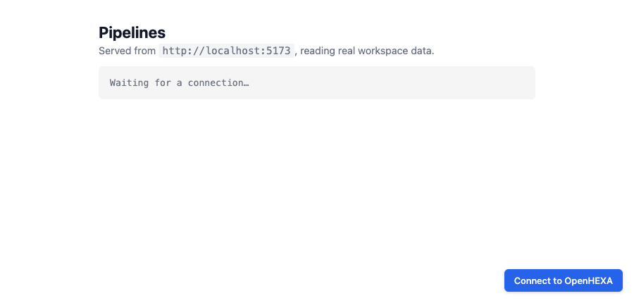
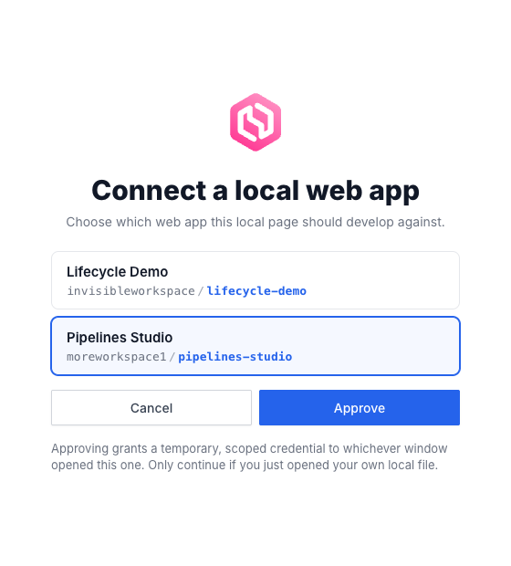
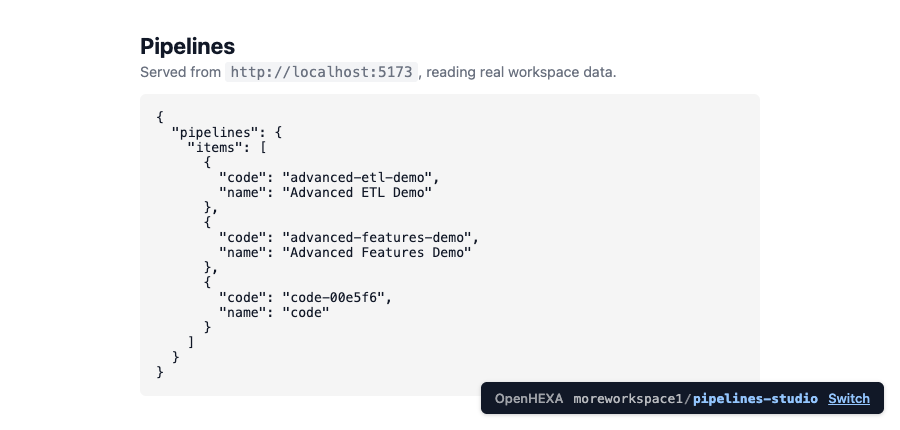

<div class="hero-section">
  <h1><i class="fas fa-hexagon" style="margin-right: 0.5rem;"></i>Webapps statiques</h1>
</div>
</div>

Les webapps statiques permettent d'héberger un petit ensemble de fichiers HTML / CSS / JavaScript dans un workspace OpenHEXA et de les servir sur leur propre sous-domaine. Elles sont utiles pour des tableaux de bord, des formulaires de saisie personnalisés, ou n'importe quelle interface front-end qui a besoin de cohabiter avec vos pipelines et jeux de données — sans avoir à mettre en place un environnement d'hébergement séparé.

OpenHEXA supporte trois types de webapps :

- **Statique** (cette page) : vous fournissez les fichiers source ; OpenHEXA les sert et fait office de proxy pour l'accès à l'API.
- **Iframe** : OpenHEXA intègre une URL externe.
- **Superset** : OpenHEXA intègre un tableau de bord Superset.

## Créer une webapp statique

Depuis l'interface du workspace : **Web Apps → Créer → Statique**, puis déposez vos fichiers ou partez du modèle `index.html` par défaut.

Par programme : utilisez l'outil MCP `create_static_webapp`, ou la mutation GraphQL `createWebapp` avec une source `static` portant une liste de fichiers `{path, content}`. Un fichier `index.html` à la racine est obligatoire.

## Structure du projet

Les fichiers vivent aux chemins que vous fournissez. `index.html` est le point d'entrée ; tout le reste (CSS, JS, images, fixtures JSON) est servi tel quel depuis la même origine.

```
index.html
app.js
style.css
assets/logo.svg
```

Référencez les ressources avec des chemins relatifs (`<script src="app.js">`, `<link href="style.css">`) pour qu'elles fonctionnent aussi bien en aperçu qu'une fois publiées.

## URL et sous-domaine

Chaque webapp obtient un sous-domaine sous le domaine webapps du workspace — par exemple `my-webapp.webapps.example.com`. Le sous-domaine reprend par défaut le slug dérivé du nom de la webapp et peut être modifié dans les paramètres de la webapp.

## Public ou privé

- **Privé** (par défaut) : seuls les membres authentifiés du workspace peuvent voir la webapp. C'est le cookie de session du navigateur qui autorise les requêtes, donc les webapps statiques privées peuvent aussi appeler l'API GraphQL d'OpenHEXA directement (voir ci-dessous).
- **Public** : n'importe qui ayant l'URL peut consulter la webapp. Les webapps publiques **ne peuvent pas** appeler le proxy GraphQL — si vous avez besoin d'exposer des données du workspace publiquement, générez un export statique depuis un pipeline et servez-le comme un fichier dans la webapp.

## Appeler l'API GraphQL d'OpenHEXA

Les webapps statiques privées peuvent appeler l'API GraphQL de la plateforme directement depuis leur code JavaScript pour lire et écrire les données du workspace. Le reste de cette page couvre cette API en détail — les webapps publiques et iframe ne peuvent pas utiliser ce point d'accès.

### Comment ça fonctionne

- **Endpoint** : `POST /graphql/` sur l'URL de la webapp elle-même (même origine). Par exemple, une webapp servie sur `https://my-webapp.webapps.example.com/` appelle `https://my-webapp.webapps.example.com/graphql/`.
- **Authentification** : gérée par la session de la webapp — le cookie de session du navigateur est attaché automatiquement. N'envoyez pas d'en-tête `Authorization` ; n'embarquez pas de token dans votre code.
- **Vérification d'origine** : seules les requêtes dont l'`Origin` correspond à celle de la webapp sont autorisées. Les appels cross-site sont rejetés.
- **Limité par scopes** : chaque webapp déclare une liste `allowed_operations`. Seuls les champs GraphQL de premier niveau couverts par ces scopes sont autorisés ; tout le reste renvoie un `403`.
- **Corps JSON** : identique à n'importe quel POST GraphQL — `{"query": "...", "variables": {...}}`.

## Activer l'API sur une webapp

Par défaut, une webapp statique a une liste `allowed_operations` vide, ce qui signifie qu'elle ne peut pas appeler l'API. Activez les scopes depuis l'interface du workspace ("Paramètres de la webapp → Accès API") ou via la mutation GraphQL `updateWebapp`.

## Référence des scopes

| Scope | Ce qu'il accorde |
|---|---|
| `USER_READ` | `me`, `workspace` |
| `PIPELINES_READ` | `pipeline`, `pipelines`, `pipelineByCode`, `pipelineRun`, `pipelineVersion` |
| `PIPELINES_RUN` | `runPipeline`, `stopPipeline` |
| `FILES_READ` | `getFileByPath`, `readFileContent`, `prepareObjectDownload` |
| `FILES_WRITE` | `prepareObjectUpload`, `createBucketFolder`, `deleteBucketObject`, `writeFileContent` |
| `DATASETS_READ` | `dataset`, `datasets`, `datasetVersion`, `datasetLink` |
| `DATASETS_WRITE` | `createDataset`, `updateDataset`, `deleteDataset`, `createDatasetVersion`, `updateDatasetVersion`, `deleteDatasetVersion`, `createDatasetVersionFile`, `deleteDatasetLink` |
| `DATABASE_READ` | `executeSavedQuery` |

Les champs d'introspection `__typename`, `__schema`, `__type` sont toujours autorisés.

!!! note "Base de données : lecture seule, et uniquement via des requêtes enregistrées"

    Une webapp ne peut pas envoyer son propre SQL — `executeSQL` est refusé sur
    ce point d'entrée quels que soient les scopes activés. `DATABASE_READ` lui
    permet d'exécuter une requête écrite et enregistrée dans le Data Studio par
    un membre du workspace, désignée par son slug. Le SQL n'est jamais renvoyé :
    la webapp peut exécuter la requête, pas la lire ni la modifier. Les requêtes
    s'exécutent avec le rôle de base de données en lecture seule.

## Le global `window.OPENHEXA`

Quand OpenHEXA sert le HTML de votre webapp statique, il injecte un petit script avant `</head>` qui expose :

```js
window.OPENHEXA = Object.freeze({
  workspaceSlug: "my-workspace",   // slug du workspace propriétaire de cette webapp
  webappSlug: "my-webapp",         // slug de cette webapp
  isPublic: false,                 // true pour les webapps publiques
});
```

Les exemples ci-dessous lisent `workspaceSlug` depuis ce global, donc ils sont copiables-collables dans n'importe quelle webapp sans avoir à modifier de constante. L'injection ne touche que les réponses `text/html` ; les fichiers CSS, JS et JSON ne sont pas modifiés.

## Développer en local

Vous pouvez développer une webapp sur votre machine — votre éditeur, votre rechargement à chaud, vos outils de développement — tout en lisant de **vraies données** du workspace via la même API filtrée par scopes qu'en production. Sans proxy fait maison ni jeton manuel : un seul script et deux clics.

### 1. Ajoutez le script à votre page

```html
<script src="https://api.openhexa.org/webapps/dev.js"></script>
```

Pointez-le vers l'hôte du **backend** OpenHEXA (l'API), pas celui de l'application — `https://api.openhexa.org/webapps/dev.js` sur OpenHEXA Cloud, `http://localhost:8000/webapps/dev.js` pour un backend local.

Les webapps créées à partir du template par défaut incluent déjà cette balise. Elle est inerte une fois déployée (elle ne s'active que sur les pages `file://` et `localhost`), vous pouvez donc la laisser dans votre `index.html`.

### 2. Ouvrez votre page et cliquez sur Connect

Ouvrez votre page dans un navigateur où vous êtes déjà connecté à OpenHEXA — soit en ouvrant directement le fichier `.html` (`file://`), soit en le servant localement (n'importe quel serveur statique convient, par ex. `python -m http.server 5173`).

Un bouton **Connect to OpenHEXA** apparaît dans le coin :



### 3. Choisissez une webapp et approuvez

Un clic ouvre une petite fenêtre OpenHEXA listant les webapps statiques privées auxquelles vous avez accès. Choisissez-en une et cliquez sur **Approve** :



### C'est tout

La fenêtre se ferme et votre page se recharge, connectée. `window.OPENHEXA` est renseigné et vos appels `fetch("/graphql/")` renvoient de vraies données. Une pastille dans le coin indique la webapp connectée :



### Éviter le sélecteur

Indiquez le workspace et la webapp directement : la liste se réduit à cette seule entrée, présélectionnée — vous confirmez toujours avec **Approve** :

```html
<script src="https://api.openhexa.org/webapps/dev.js" data-workspace-slug="my-workspace" data-webapp-slug="my-webapp"></script>
```

### Bon à savoir

- **Les mêmes permissions qu'en production.** Vos appels locaux respectent les `allowed_operations` de la webapp exactement comme une fois déployée : une opération qui fonctionne en local ne renverra pas un `403` plus tard.
- **La pastille est votre contrôle.** Utilisez **Switch** pour passer à une autre webapp, ou **Reconnect** pour forcer un nouvel identifiant.

---

## Exemples de webapps

Chaque exemple ci-dessous est un `index.html` complet que vous pouvez déposer dans une webapp statique. Tous les exemples embarquent la même petite fonction `gql()` pour rester autonomes, et lisent leur slug de workspace depuis `window.OPENHEXA`.

### USER_READ — Qui suis-je ?

Affiche l'utilisateur courant et le workspace au chargement.

```html
<!DOCTYPE html>
<html>
<head>
  <meta charset="utf-8">
  <title>Qui suis-je ?</title>
  <style>
    body { font-family: system-ui, sans-serif; max-width: 640px; margin: 2rem auto; padding: 0 1rem; }
    pre { background: #f5f5f5; padding: 1rem; border-radius: 4px; overflow-x: auto; }
  </style>
</head>
<body>
  <h1>Qui suis-je ?</h1>
  <pre id="out">Chargement…</pre>

  <script>
    const { workspaceSlug } = window.OPENHEXA;

    async function gql(query, variables = {}) {
      const res = await fetch("/graphql/", {
        method: "POST",
        headers: { "Content-Type": "application/json" },
        body: JSON.stringify({ query, variables }),
      });
      const json = await res.json();
      if (json.errors) throw new Error(json.errors.map(e => e.message).join("; "));
      return json.data;
    }

    (async () => {
      const data = await gql(`
        query($slug: String!) {
          me { user { id email displayName } }
          workspace(slug: $slug) { slug name description }
        }
      `, { slug: workspaceSlug });
      document.getElementById("out").textContent = JSON.stringify(data, null, 2);
    })();
  </script>
</body>
</html>
```

### PIPELINES_READ — Lister les pipelines

Liste tous les pipelines du workspace.

```html
<!DOCTYPE html>
<html>
<head>
  <meta charset="utf-8">
  <title>Pipelines</title>
  <style>
    body { font-family: system-ui, sans-serif; max-width: 720px; margin: 2rem auto; padding: 0 1rem; }
    li { margin-bottom: 0.75rem; }
    code { background: #f5f5f5; padding: 0.1rem 0.3rem; border-radius: 3px; }
  </style>
</head>
<body>
  <h1>Pipelines</h1>
  <ul id="list"><li>Chargement…</li></ul>

  <script>
    const { workspaceSlug } = window.OPENHEXA;

    async function gql(query, variables = {}) {
      const res = await fetch("/graphql/", {
        method: "POST",
        headers: { "Content-Type": "application/json" },
        body: JSON.stringify({ query, variables }),
      });
      const json = await res.json();
      if (json.errors) throw new Error(json.errors.map(e => e.message).join("; "));
      return json.data;
    }

    (async () => {
      const { pipelines } = await gql(`
        query($slug: String!) {
          pipelines(workspaceSlug: $slug, page: 1, perPage: 50) {
            items { id code name description schedule }
          }
        }
      `, { slug: workspaceSlug });

      const list = document.getElementById("list");
      list.innerHTML = "";
      for (const p of pipelines.items) {
        const li = document.createElement("li");
        li.innerHTML = `<strong>${p.name}</strong> <code>${p.code}</code><br><small>${p.description ?? ""}</small>`;
        list.appendChild(li);
      }
    })();
  </script>
</body>
</html>
```

### PIPELINES_READ + PIPELINES_RUN — Choisir un pipeline et le lancer

Charge la liste des pipelines à l'ouverture de la page, vous laisse en choisir un dans une liste déroulante, et le lance avec une configuration JSON. Interroge le statut jusqu'à la fin de l'exécution. Nécessite à la fois `PIPELINES_READ` (pour lister) et `PIPELINES_RUN` (pour lancer).

```html
<!DOCTYPE html>
<html>
<head>
  <meta charset="utf-8">
  <title>Lancer un pipeline</title>
  <style>
    body { font-family: system-ui, sans-serif; max-width: 640px; margin: 2rem auto; padding: 0 1rem; }
    label { display: block; margin: 0.75rem 0 0.25rem; font-weight: 500; }
    select, textarea { width: 100%; padding: 0.4rem; box-sizing: border-box; font-family: inherit; }
    button { margin-top: 1rem; padding: 0.5rem 1rem; }
    button[disabled] { opacity: 0.5; cursor: not-allowed; }
    #status { margin-top: 1rem; font-weight: 600; }
  </style>
</head>
<body>
  <h1>Lancer un pipeline</h1>

  <label>Pipeline
    <select id="pipeline" disabled><option>Chargement…</option></select>
  </label>
  <label>Configuration (JSON)
    <textarea id="cfg" rows="4">{}</textarea>
  </label>
  <button id="runBtn" disabled onclick="runIt()">Lancer</button>

  <p id="status"></p>

  <script>
    const { workspaceSlug } = window.OPENHEXA;

    async function gql(query, variables = {}) {
      const res = await fetch("/graphql/", {
        method: "POST",
        headers: { "Content-Type": "application/json" },
        body: JSON.stringify({ query, variables }),
      });
      const json = await res.json();
      if (json.errors) throw new Error(json.errors.map(e => e.message).join("; "));
      return json.data;
    }

    // 1. Charger la liste des pipelines et remplir la liste déroulante.
    (async () => {
      const { pipelines } = await gql(`
        query($slug: String!) {
          pipelines(workspaceSlug: $slug, page: 1, perPage: 100) {
            items { id code name }
          }
        }
      `, { slug: workspaceSlug });

      const select = document.getElementById("pipeline");
      if (!pipelines.items.length) {
        select.innerHTML = '<option>(aucun pipeline dans ce workspace)</option>';
        return;
      }
      select.innerHTML = pipelines.items
        .map(p => `<option value="${p.id}">${p.name} (${p.code})</option>`)
        .join("");
      select.disabled = false;
      document.getElementById("runBtn").disabled = false;
    })();

    // 2. Lancer le pipeline sélectionné et interroger le statut jusqu'à la fin.
    async function runIt() {
      const id = document.getElementById("pipeline").value;
      const config = JSON.parse(document.getElementById("cfg").value || "{}");
      const status = document.getElementById("status");

      const { runPipeline } = await gql(`
        mutation($input: RunPipelineInput!) {
          runPipeline(input: $input) {
            success errors run { id status }
          }
        }
      `, { input: { id, config } });

      if (!runPipeline.success) {
        status.textContent = "Erreur : " + runPipeline.errors.join(", ");
        return;
      }

      const runId = runPipeline.run.id;
      status.textContent = "Exécution en cours…";

      while (true) {
        await new Promise(r => setTimeout(r, 2000));
        const { pipelineRun } = await gql(
          `query($id: UUID!) { pipelineRun(id: $id) { status } }`,
          { id: runId },
        );
        status.textContent = "Statut : " + pipelineRun.status;
        if (["success", "failed", "stopped", "skipped"].includes(pipelineRun.status)) break;
      }
    }
  </script>
</body>
</html>
```

### USER_READ + FILES_READ — Choisir un CSV dans le bucket du workspace et l'afficher

Liste les fichiers CSV du bucket au chargement de la page, vous laisse en choisir un dans une liste déroulante, et affiche les 100 premières lignes dans un tableau. Nécessite à la fois `USER_READ` (pour lister les fichiers via `workspace.bucket.objects`) et `FILES_READ` (pour lire le contenu).

```html
<!DOCTYPE html>
<html>
<head>
  <meta charset="utf-8">
  <title>Aperçu CSV</title>
  <style>
    body { font-family: system-ui, sans-serif; max-width: 800px; margin: 2rem auto; padding: 0 1rem; }
    label { display: block; margin: 0.75rem 0 0.25rem; font-weight: 500; }
    select { width: 100%; padding: 0.4rem; box-sizing: border-box; font-family: inherit; }
    button { margin-top: 0.75rem; padding: 0.5rem 1rem; }
    button[disabled] { opacity: 0.5; cursor: not-allowed; }
    table { border-collapse: collapse; margin-top: 1rem; width: 100%; }
    th, td { border: 1px solid #ddd; padding: 0.3rem 0.5rem; font-size: 0.9rem; }
    th { background: #f5f5f5; }
    #status { margin-top: 1rem; color: #b91c1c; }
  </style>
</head>
<body>
  <h1>Aperçu CSV</h1>

  <label>Fichier
    <select id="file" disabled><option>Chargement…</option></select>
  </label>
  <button id="loadBtn" disabled onclick="load()">Charger</button>

  <p id="status"></p>
  <div id="table"></div>

  <script>
    const { workspaceSlug } = window.OPENHEXA;

    async function gql(query, variables = {}) {
      const res = await fetch("/graphql/", {
        method: "POST",
        headers: { "Content-Type": "application/json" },
        body: JSON.stringify({ query, variables }),
      });
      const json = await res.json();
      if (json.errors) throw new Error(json.errors.map(e => e.message).join("; "));
      return json.data;
    }

    // 1. Lister les fichiers CSV du bucket et remplir la liste déroulante.
    (async () => {
      const { workspace } = await gql(`
        query($slug: String!) {
          workspace(slug: $slug) {
            bucket {
              objects(page: 1, perPage: 200, ignoreHiddenFiles: true) {
                items { key name path type }
              }
            }
          }
        }
      `, { slug: workspaceSlug });

      const csvFiles = workspace.bucket.objects.items
        .filter(o => o.type === "FILE" && o.name.toLowerCase().endsWith(".csv"));

      const select = document.getElementById("file");
      if (!csvFiles.length) {
        select.innerHTML = '<option>(aucun fichier CSV dans ce workspace)</option>';
        return;
      }
      select.innerHTML = csvFiles
        .map(f => `<option value="${f.key}">${f.key}</option>`)
        .join("");
      select.disabled = false;
      document.getElementById("loadBtn").disabled = false;
    })();

    // 2. Récupérer et afficher le fichier sélectionné dans un tableau.
    async function load() {
      const path = document.getElementById("file").value;
      const status = document.getElementById("status");
      const out = document.getElementById("table");
      status.textContent = "";
      out.innerHTML = "";

      const { readFileContent } = await gql(`
        query($slug: String!, $path: String!) {
          readFileContent(workspaceSlug: $slug, filePath: $path, startLine: 1, endLine: 100) {
            success content
          }
        }
      `, { slug: workspaceSlug, path });

      if (!readFileContent.success || !readFileContent.content) {
        status.textContent = "Impossible de lire ce fichier (il est peut-être vide ou non lisible en texte).";
        return;
      }

      const rows = readFileContent.content.trim().split("\n").map(l => l.split(","));
      const [header, ...body] = rows;
      out.innerHTML = [
        "<table><thead><tr>",
        header.map(h => `<th>${h}</th>`).join(""),
        "</tr></thead><tbody>",
        body.map(r => "<tr>" + r.map(c => `<td>${c}</td>`).join("") + "</tr>").join(""),
        "</tbody></table>",
      ].join("");
    }
  </script>
</body>
</html>
```

### FILES_WRITE — Téléverser un fichier dans le bucket du workspace

Sélectionnez un fichier, téléversez-le via une URL présignée.

```html
<!DOCTYPE html>
<html>
<head>
  <meta charset="utf-8">
  <title>Téléverser un fichier</title>
  <style>
    body { font-family: system-ui, sans-serif; max-width: 560px; margin: 2rem auto; padding: 0 1rem; }
    input { width: 100%; padding: 0.4rem; box-sizing: border-box; }
    button { margin-top: 0.5rem; padding: 0.5rem 1rem; }
    #status { margin-top: 1rem; font-weight: 600; }
  </style>
</head>
<body>
  <h1>Téléverser un fichier</h1>

  <label>Clé de destination (chemin dans le bucket)
    <input id="key" value="uploads/example.bin">
  </label>
  <input type="file" id="file">
  <button onclick="upload()">Téléverser</button>

  <p id="status"></p>

  <script>
    const { workspaceSlug } = window.OPENHEXA;

    async function gql(query, variables = {}) {
      const res = await fetch("/graphql/", {
        method: "POST",
        headers: { "Content-Type": "application/json" },
        body: JSON.stringify({ query, variables }),
      });
      const json = await res.json();
      if (json.errors) throw new Error(json.errors.map(e => e.message).join("; "));
      return json.data;
    }

    async function upload() {
      const status = document.getElementById("status");
      const blob = document.getElementById("file").files[0];
      const key = document.getElementById("key").value.trim();
      if (!blob) { status.textContent = "Sélectionnez d'abord un fichier."; return; }

      const { prepareObjectUpload } = await gql(`
        mutation($input: PrepareObjectUploadInput!) {
          prepareObjectUpload(input: $input) { success uploadUrl headers }
        }
      `, { input: { workspaceSlug: workspaceSlug, objectKey: key, contentType: blob.type } });

      const res = await fetch(prepareObjectUpload.uploadUrl, {
        method: "PUT",
        headers: { ...prepareObjectUpload.headers, "Content-Type": blob.type },
        body: blob,
      });
      status.textContent = res.ok ? "Téléversé ✓" : `Échec : HTTP ${res.status}`;
    }
  </script>
</body>
</html>
```

### DATASETS_READ — Lister les jeux de données

Liste les jeux de données visibles depuis le workspace, avec leur dernière version.

```html
<!DOCTYPE html>
<html>
<head>
  <meta charset="utf-8">
  <title>Jeux de données</title>
  <style>
    body { font-family: system-ui, sans-serif; max-width: 720px; margin: 2rem auto; padding: 0 1rem; }
    li { margin-bottom: 0.75rem; }
    small { color: #666; }
  </style>
</head>
<body>
  <h1>Jeux de données</h1>
  <ul id="list"><li>Chargement…</li></ul>

  <script>
    const { workspaceSlug } = window.OPENHEXA;

    async function gql(query, variables = {}) {
      const res = await fetch("/graphql/", {
        method: "POST",
        headers: { "Content-Type": "application/json" },
        body: JSON.stringify({ query, variables }),
      });
      const json = await res.json();
      if (json.errors) throw new Error(json.errors.map(e => e.message).join("; "));
      return json.data;
    }

    (async () => {
      const { workspace } = await gql(`
        query($slug: String!) {
          workspace(slug: $slug) {
            datasets(page: 1, perPage: 50) {
              items {
                dataset {
                  id slug name description
                  latestVersion { name createdAt }
                }
              }
            }
          }
        }
      `, { slug: workspaceSlug });

      const list = document.getElementById("list");
      list.innerHTML = "";
      for (const item of workspace.datasets.items) {
        const d = item.dataset;
        const li = document.createElement("li");
        const v = d.latestVersion ? `${d.latestVersion.name} — ${new Date(d.latestVersion.createdAt).toLocaleDateString()}` : "aucune version pour l'instant";
        li.innerHTML = `<strong>${d.name}</strong><br><small>Dernière : ${v}</small>`;
        list.appendChild(li);
      }
    })();
  </script>
</body>
</html>
```

### DATASETS_WRITE — Créer un nouveau jeu de données

Petit formulaire qui crée un jeu de données et affiche le nouvel id/slug.

```html
<!DOCTYPE html>
<html>
<head>
  <meta charset="utf-8">
  <title>Créer un jeu de données</title>
  <style>
    body { font-family: system-ui, sans-serif; max-width: 560px; margin: 2rem auto; padding: 0 1rem; }
    label { display: block; margin: 0.5rem 0 0.25rem; }
    input, textarea { width: 100%; padding: 0.4rem; box-sizing: border-box; font-family: inherit; }
    button { margin-top: 1rem; padding: 0.5rem 1rem; }
    #out { margin-top: 1rem; }
  </style>
</head>
<body>
  <h1>Créer un jeu de données</h1>

  <label>Nom
    <input id="name" placeholder="Résultats d'enquête">
  </label>
  <label>Description
    <textarea id="desc" rows="3"></textarea>
  </label>
  <button onclick="create()">Créer</button>

  <p id="out"></p>

  <script>
    const { workspaceSlug } = window.OPENHEXA;

    async function gql(query, variables = {}) {
      const res = await fetch("/graphql/", {
        method: "POST",
        headers: { "Content-Type": "application/json" },
        body: JSON.stringify({ query, variables }),
      });
      const json = await res.json();
      if (json.errors) throw new Error(json.errors.map(e => e.message).join("; "));
      return json.data;
    }

    async function create() {
      const out = document.getElementById("out");
      const name = document.getElementById("name").value.trim();
      const description = document.getElementById("desc").value.trim();
      if (!name) { out.textContent = "Le nom est obligatoire."; return; }

      const { createDataset } = await gql(`
        mutation($input: CreateDatasetInput!) {
          createDataset(input: $input) {
            success errors dataset { id slug name }
          }
        }
      `, { input: { workspaceSlug: workspaceSlug, name, description } });

      if (!createDataset.success) {
        out.textContent = "Erreur : " + (createDataset.errors || []).join(", ");
        return;
      }
      out.textContent = `Créé : ${createDataset.dataset.name} (slug : ${createDataset.dataset.slug})`;
    }
  </script>
</body>
</html>
```

### DATABASE_READ — Exécuter une requête enregistrée

Exécute une requête enregistrée dans le Data Studio et affiche les lignes dans
un tableau. La webapp désigne la requête par son slug ; elle ne détient jamais
le SQL.

<details markdown="1">
<summary>Schéma</summary>

```graphql
type Query {
  executeSavedQuery(input: ExecuteSavedQueryInput!): ExecuteSQLResult!
}

input ExecuteSavedQueryInput {
  workspaceSlug: String!
  slug: String!
  maxRows: Int
}

# Same payload as executeSQL.
type ExecuteSQLResult {
  success: Boolean!
  errors: [ExecuteSQLError!]!
  errorMessage: String
  columns: [String!]
  rows: [JSON!]
  rowCount: Int
  truncated: Boolean
  durationMs: Int
}

enum ExecuteSQLError {
  SAVED_QUERY_NOT_FOUND
  PERMISSION_DENIED
  QUERY_TIMEOUT
  QUERY_ERROR
  MULTIPLE_STATEMENTS
}
```

[Parcourir le schéma complet dans le playground →](https://app.openhexa.org/graphql/)

</details>

Le slug se lit dans le Data Studio : c'est le dernier segment de l'URL de la
requête enregistrée. `SAVED_QUERY_NOT_FOUND` couvre à la fois un slug inconnu et
un workspace que vous ne pouvez pas voir, afin de ne rien révéler de ce qui
existe.

```html
<!DOCTYPE html>
<html>
<head>
  <meta charset="utf-8">
  <title>Requête enregistrée</title>
  <style>
    body { font-family: system-ui, sans-serif; max-width: 900px; margin: 2rem auto; padding: 0 1rem; }
    table { border-collapse: collapse; width: 100%; }
    th, td { border: 1px solid #e5e7eb; padding: 0.375rem 0.5rem; text-align: left; font-size: 0.875rem; }
    th { background: #f9fafb; }
  </style>
</head>
<body>
  <h1>Requête enregistrée</h1>
  <div id="out">Chargement…</div>

  <script>
    const { workspaceSlug } = window.OPENHEXA;
    const SAVED_QUERY_SLUG = "ma-requete-enregistree";

    async function gql(query, variables) {
      const res = await fetch("/graphql/", {
        method: "POST",
        credentials: "include",
        headers: { "Content-Type": "application/json" },
        body: JSON.stringify({ query, variables }),
      });
      const json = await res.json();
      if (json.errors) throw new Error(json.errors.map(e => e.message).join("; "));
      return json.data;
    }

    (async () => {
      const out = document.getElementById("out");
      const { executeSavedQuery: result } = await gql(`
        query($input: ExecuteSavedQueryInput!) {
          executeSavedQuery(input: $input) {
            success errors columns rows rowCount truncated
          }
        }
      `, { input: { workspaceSlug, slug: SAVED_QUERY_SLUG, maxRows: 100 } });

      if (!result.success) {
        out.textContent = "Erreur : " + result.errors.join(", ");
        return;
      }

      const header = result.columns.map(c => `<th>${c}</th>`).join("");
      const body = result.rows.map(row =>
        `<tr>${result.columns.map(c => `<td>${row[c] ?? ""}</td>`).join("")}</tr>`
      ).join("");
      out.innerHTML = `<table><thead><tr>${header}</tr></thead><tbody>${body}</tbody></table>` +
        (result.truncated ? `<p>Affichage des ${result.rowCount} premières lignes.</p>` : "");
    })();
  </script>
</body>
</html>
```
