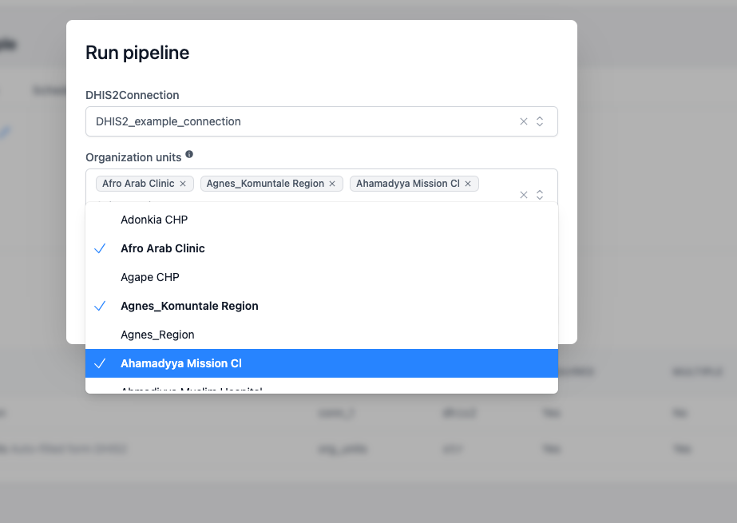

<div class="hero-section">
  <h1><i class="fas fa-hexagon" style="margin-right: 0.5rem;"></i>Écrire des pipelines OpenHEXA</h1>
</div>
</div>

Les pipelines de données OpenHEXA permettent d'automatiser les opérations de traitement et de modélisation de données.

Ils sont écrits en Python et offrent les capacités suivantes :

- **Développement local :** écrivez vos pipelines dans votre IDE préféré sur votre ordinateur portable avant de les déployer dans le cloud
- **Gestion des E/S :** interagissez avec le système de fichiers et la base de données de votre espace de travail OpenHEXA, et connectez-vous à des sources de données externes
- **Traitement parallèle :** définissez des tâches qui peuvent être exécutées en parallèle
- **Planification :** planifiez l'exécution automatique de votre pipeline à un intervalle spécifique

Le présent guide vous accompagnera dans la création et le déploiement d'un pipeline OpenHEXA. Vous pouvez également trouver les deux guides suivants intéressants :

- [Utiliser le SDK OpenHEXA](sdk.md) : le SDK OpenHEXA est une bibliothèque Python qui fournit des blocs de construction et des méthodes utilitaires pour écrire du code sur OpenHEXA
- [Utiliser l'OpenHEXA CLI](cli.md) : l'OpenHEXA CLI est un utilitaire en ligne de commande qui vous permet d'interagir avec votre instance OpenHEXA depuis votre terminal
- [Utiliser l'OpenHEXA Toolbox - DHIS2](toolbox-dhis2.md) : Acquérir et traiter des données depuis des instances DHIS2
- [Utiliser l'OpenHEXA Toolbox - IASO](toolbox-iaso.md) : Récupérer des données depuis IASO
- [Client OpenHEXA](toolbox-hexa.md) : Client GraphQL typé pour la plateforme OpenHEXA

## Démarrage rapide

Vous pouvez créer deux types de pipelines OpenHEXA :

- Le premier est le plus simple et repose sur un Jupyter Notebook
- Le second, plus complexe, nécessite l'écriture de code en Python et son téléversement vers la plateforme avec l'OpenHEXA CLI

## Créer un pipeline avec un Jupyter Notebook

C'est la manière la plus simple de créer un pipeline et cela peut être fait depuis l'interface web. Une fois que vous avez écrit un Jupyter Notebook avec l'interface JupyterLab de votre espace de travail, allez dans l'onglet pipelines et cliquez sur "create". Sélectionnez ensuite le notebook que vous souhaitez utiliser pour le pipeline.
Exemple :


Sachez que ce type de pipeline comporte des limitations :
- Vous ne pouvez pas ajouter de paramètres au notebook via l'interface d'exécution.
- Les Jupyter Notebooks ne sont pas versionnés et ne doivent pas être déplacés ou supprimés puisque nous utilisons le chemin du notebook pour exécuter le pipeline.


## Créer un pipeline avec la CLI

## Prérequis

Le SDK OpenHEXA nécessite Python version 3.9 ou ultérieure, mais il n'est pas encore compatible avec Python 3.12 ou les versions ultérieures.

Si vous voulez pouvoir exécuter des pipelines sur votre machine, vous aurez besoin de [Docker](https://www.docker.com/).

## Votre premier pipeline

Voici un exemple super minimal pour commencer. Tout d'abord, créez un nouveau répertoire et un environnement virtuel :

```shell
mkdir openhexa-pipelines-tutorial
cd openhexa-pipelines-tutorial
python -m venv venv
source venv/bin/activate
```

Pour écrire un pipeline OpenHEXA, vous devez installer le [SDK OpenHEXA](https://pypi.org/project/openhexa.sdk/) :

```shell
pip install --upgrade openhexa.sdk
```

Pour plus d'informations, consultez la page de manuel dédiée à l'[OpenHEXA CLI](cli.md).

> 💡 De nouvelles versions du SDK OpenHEXA sont publiées régulièrement. N'oubliez pas de mettre à jour vos installations locales avec
`pip install --upgrade` de temps en temps !

> 💡 Si vous exécutez OpenHEXA localement, vous devez configurer l'URL avant de créer des pipelines : `openhexa config set_url http://localhost:8000`

Maintenant que le SDK est installé dans votre environnement virtuel, vous pouvez utiliser l'utilitaire CLI `openhexa` pour interagir avec la plateforme OpenHEXA.

Dans l'interface web OpenHEXA, à l'intérieur d'un espace de travail, naviguez vers l'onglet Pipelines et cliquez sur "Create".

Copiez la commande affichée dans le popup dans votre terminal :

```shell
openhexa workspaces add <workspace>
```

On vous demandera un jeton d'authentification, vous pouvez également le trouver dans le popup.

Si vous avez déjà configuré un ou plusieurs espaces de travail OpenHEXA auparavant, vous pouvez voir les espaces de travail configurés avec la commande `openhexa workspaces list`, et vous pouvez basculer vers un autre espace de travail avec la commande `openhexa workspaces activate <workspace>`.

Si vous avez besoin de mettre à jour votre jeton d'espace de travail, vous pouvez exécuter `openhexa workspaces add <workspace>` à nouveau, même si l'espace de travail a déjà été ajouté, la CLI vous demandera un jeton qui remplacera le précédent.

```shell
openhexa pipelines init "Simple ETL"
```

Vous pouvez sélectionner les options par défaut pour les questions posées par la CLI en appuyant sur `enter`. Cela créera la structure de base du pipeline et un workflow Github Actions qui poussera le pipeline vers votre plateforme.

Génial ! Comme vous pouvez le voir dans la sortie console, l'OpenHEXA CLI a créé un nouveau répertoire, qui contient la
structure de base requise pour un pipeline OpenHEXA. Vous pouvez maintenant `cd` dans le nouveau répertoire de pipeline et exécuter le pipeline :

```shell
cd simple_etl
openhexa pipelines run .
```

Félicitations ! Vous avez exécuté avec succès votre premier pipeline localement.

Si vous inspectez le fichier `pipeline.py`, vous verrez qu'il ne fait pas grand-chose, mais c'est tout de même un pipeline OpenHEXA parfaitement valide.

Une fois satisfait de votre pipeline, vous pouvez le pousser vers le cloud avec la commande `openhexa pipelines push`. Cela créera un pipeline dans l'interface web et vous pourrez l'exécuter depuis là.

```shell
openhexa pipelines push
```

Comme c'est la première fois, la CLI vous demandera de confirmer l'opération de création. Après confirmation, la console
affichera le lien vers l'écran du pipeline dans l'interface OpenHEXA.

Vous pouvez maintenant ouvrir le lien et exécuter le pipeline avec l'interface web OpenHEXA.


## Contrôle de version

Nous recommandons l'utilisation de `git` pour le contrôle de version lors du travail avec les pipelines OpenHEXA. Cela vous permettra de suivre les changements, de collaborer avec d'autres et de pousser votre code vers le cloud automatiquement. Si vous n'êtes pas familier avec Git, nous vous recommandons de lire les tutoriels de la [documentation](https://git-scm.com/doc). Vous pouvez initialiser un nouveau dépôt git dans votre répertoire de pipeline :

```shell
git init
```

Vous pouvez ensuite ajouter vos fichiers au dépôt et les commit :

```shell
git add .
git commit -m "Initial commit"
```

Si vous avez un dépôt GitHub, vous pouvez y pousser votre code :

```shell
git remote add origin <your-repository-url>
git push -u origin main
```

## Déploiement de pipelines

En utilisant la commande `openhexa init` pour créer un nouveau pipeline, vous obtiendrez un répertoire `.github/workflows` avec une Github Action qui poussera automatiquement votre pipeline vers le backend OpenHEXA quand vous pousserez vers votre dépôt git. 3 modes sont disponibles lorsque vous créez un pipeline avec la commande :
- *push* (par défaut) : le pipeline sera poussé vers le backend OpenHEXA
- *release* : le pipeline sera poussé vers le backend OpenHEXA et tagué avec la version de la release
- *manual* : le pipeline ne sera poussé vers le backend OpenHEXA que lorsque vous exécuterez la Github Action manuellement

Pour utiliser la github action, vous devez ajouter le secret `OH_TOKEN` à votre dépôt. Vous pouvez trouver le jeton dans l'interface web OpenHEXA dans l'onglet "Pipelines".

Vous pouvez également pousser manuellement votre pipeline vers le backend OpenHEXA avec la commande `openhexa pipelines push`.

Si le template par défaut de la Github Action ne convient pas à vos besoins, vous pouvez le modifier pour répondre à vos exigences. Vous pouvez également créer votre propre fichier de workflow Github Action dans le répertoire `.github/workflows` en utilisant l'exemple ci-dessous :

```yaml
name: push-pipeline

on:
  push:
    branches:
      - main

jobs:
  deploy:
    runs-on: ubuntu-latest

    steps:
      - name: Checkout
        uses: actions/checkout@v2

      - uses: actions/setup-python@v2
        with:
          python-version: '3.11'

      - name: Configure OpenHEXA CLI
        uses: blsq/openhexa-cli-action@v1
        with:
          workspace: "<insert-your-workspace-slug>"
          token: ${{ secrets.OH_TOKEN }}
      - name: Push pipeline to OpenHEXA
        run: |
          openhexa pipelines push . --yes
```

## Dépôts avec plusieurs pipelines

Le workflow Github action par défaut créé avec la commande `openhexa init` suppose que le dépôt contient un seul pipeline. Les dépôts avec plusieurs pipelines dans des sous-répertoires peuvent être pris en charge avec la stratégie de déclencheur suivante :

``` yaml
name: Push pipeline

on:
  push:
    paths:
      - ".github/workflows/push-my-pipeline.yml"
      - "my_pipeline/**"
```

La propriété `paths:` garantit que seuls les commits qui modifient les fichiers situés dans le sous-répertoire du pipeline (ou le fichier de workflow) déclencheront l'action. La stratégie nécessite un fichier de workflow par pipeline.

## Nommer automatiquement les versions de pipeline

Les noms et URLs des versions de pipeline peuvent être générés automatiquement en fonction du hash du commit qui a déclenché le déploiement :

``` yaml
      - name: Push pipeline to OpenHEXA
        run: |
          openhexa pipelines push moodle_extract \
            -n ${{ github.sha }} \
            -l "https://github.com/BLSQ/openhexa-pipelines-lifenet/commit/${{ github.sha }}" \
            --yes
```

## Anatomie d'un pipeline OpenHEXA

## Structure du répertoire de pipeline

Examinons de plus près les ressources créées par `openhexa pipelines init` pour mieux comprendre comment les pipelines OpenHEXA sont construits. Dans le répertoire `simple_etl` :

```shell
ls -la
```

Vous pouvez voir que les fichiers/répertoires suivants ont été créés :

- `.gitignore` : si vous utilisez le contrôle de version, ce fichier d'ignore par défaut s'assurera que vous ne pousserez pas les fichiers de développement vers votre dépôt (principalement le contenu du dossier `workspace` et le fichier `workspace.yaml`, voir ci-dessous)
- `pipeline.py` : le code réel du pipeline
- `workspace` : un répertoire que vous pouvez utiliser pour simuler le système de fichiers de l'espace de travail disponible en ligne
- `workspace.yaml` : le fichier de configuration de l'espace de travail de développement — plus d'informations à ce sujet plus tard
- `.github/workflows/push-pipeline.yml` : un workflow GitHub Actions qui poussera le pipeline vers le cloud lorsque vous committerez et pousserez vos changements vers votre dépôt.

À ce stade, il est utile de mentionner que pour avoir un pipeline OpenHEXA valide, vous avez besoin :

1. D'un répertoire pour le pipeline (un pipeline par répertoire)
2. D'un module Python `pipeline.py` (ce script peut importer d'autres modules mais la déclaration du pipeline doit résider dans le fichier `pipeline.py`)

Pour référence, voici un exemple de fichier `workspace.yaml` valide :

```yaml
database:
  host: localhost
  username: some_username
  password: some_password
  dbname: the_db_name
  port: 5432
files:
  path: ./workspace
```

## Pipelines et tâches

Ouvrons le fichier `pipeline.py` pour voir comment un pipeline OpenHEXA doit être codé.

Comme vous pouvez le voir, le pipeline ne fait pas grand-chose à ce stade :

```python
from openhexa.sdk import current_run, pipeline


@pipeline("simple-etl")
def simple_etl():
    count = task_1()
    task_2(count)


@simple_etl.task
def task_1():
    current_run.log_info("In task 1...")

    return 42


@simple_etl.task
def task_2(count):
    current_run.log_info(f"In task 2... count is {count}")


if __name__ == "__main__":
    simple_etl()
```

Cet exemple est assez basique, mais il illustre comment vous pouvez coordonner les différentes étapes de votre pipeline de données.

Chaque tâche est évaluée dès que le pipeline est décoré par le décorateur `@pipeline`, mais la tâche réelle ne sera exécutée que lorsque le pipeline est exécuté (dans notre exemple, via l'appel `simple_etl()` au bas du fichier).

Les valeurs de retour de chaque tâche sont stockées dans une variable au runtime, et peuvent être passées à la tâche suivante en tant que paramètre : c'est ainsi que les dépendances d'exécution des tâches sont déterminées (un pipeline OpenHEXA est en réalité un [Graphe Acyclique Dirigé](https://en.wikipedia.org/wiki/Directed_acyclic_graph)).

Modifions notre pipeline pour illustrer davantage. Pendant que nous y sommes, transformons ce pipeline en quelque chose qui ressemble réellement à un véritable pipeline ETL.

Tout d'abord, installons quelques bibliothèques supplémentaires dans notre environnement virtuel :

```shell
pip install pandas SQLAlchemy psycopg2
```

Puis, adaptez `pipeline.py` comme suit :

```python
from time import sleep
import pandas as pd

from openhexa.sdk import current_run, pipeline


@pipeline("simple-etl")
def simple_etl():
    people_data = extract_people_data()
    activity_data = extract_activity_data()
    transformed_data = transform(people_data, activity_data)
    load(transformed_data)


@simple_etl.task
def extract_people_data():
    current_run.log_info("Extracting people data...")
    sleep(2)  # Faisons comme si nous interrogions un système externe

    return pd.DataFrame([{"id": 1, "first_name": "Mary", "last_name": "Johnson"},
                         {"id": 2, "first_name": "Peter", "last_name": "Jackson"},
                         {"id": 3, "first_name": "Taylor", "last_name": "Smith"}]).set_index("id")


@simple_etl.task
def extract_activity_data():
    current_run.log_info(f"Extracting activity data...")
    sleep(4)  # Faisons comme si nous interrogions un système externe

    return pd.DataFrame([{"id": 1, "person": 1, "activity": "Activity 1"},
                         {"id": 1, "person": 1, "activity": "Activity 1"},
                         {"id": 1, "person": 1, "activity": "Activity 2"},
                         {"id": 1, "person": 1, "activity": "Activity 3"},
                         {"id": 1, "person": 2, "activity": "Activity 2"},
                         {"id": 2, "person": 2, "activity": "Activity 3"},
                         {"id": 2, "person": 3, "activity": "Activity 1"},
                         {"id": 2, "person": 3, "activity": "Activity 2"}]).set_index("id")


@simple_etl.task
def transform(people_data, activity_data):
    current_run.log_info(f"Transforming data...")
    combined_df = activity_data.join(people_data, on="person").reset_index()

    return combined_df


@simple_etl.task
def load(transformed_data):
    current_run.log_info(f"Loading data ({len(transformed_data)} records)")


if __name__ == "__main__":
    simple_etl()
```

Voici ce qui se passe lorsque vous exécutez ce pipeline :

1. Les tâches `extract_people_data` et `extract_activity_data` ne dépendent d'aucune autre tâche (aucune ne prend la valeur de retour d'une autre tâche en argument), et elles seront toutes deux exécutées immédiatement, **en parallèle**
1. La tâche `transform` dépend des valeurs de retour de `extract_people_data` et `extract_activity_data`, et attendra donc que les deux tâches se terminent avant de s'exécuter
1. La tâche `load` sera exécutée dès que la tâche `transform` se termine

Vous êtes libre d'organiser votre pipeline et vos tâches comme vous le souhaitez, tant que vous vous souvenez de quelques points clés :
- La fonction pipeline (celle décorée par `@pipeline`) est utilisée pour créer le graphe d'exécution du pipeline
- Les tâches (décorées par `@simple_etl.task`) sont les unités de travail réelles, c'est là que le traitement des données doit avoir lieu
- ⚠️ Vous ne devez pas effectuer de traitement de données dans la fonction pipeline — elle ne doit servir qu'à orchestrer les tâches
- Les tâches peuvent retourner des valeurs, tant que ces valeurs [peuvent être picklées](https://docs.python.org/3/library/pickle.html#what-can-be-pickled-and-unpickled)
- Comme illustré ci-dessus, une tâche peut prendre la valeur de retour d'une autre tâche en argument, tant qu'elle est fournie comme argument individuel, pas dans une liste ou un dictionnaire (dans notre exemple `count`, retourné par `task_1` est un argument valide pour `task_2`, mais `{"count": count}` ou `[count]` ne fonctionneraient pas)
- Vous ne pouvez pas utiliser les valeurs de retour de tâche dans votre fonction pipeline principale (celle décorée avec `@pipeline`) : les valeurs de retour de tâche sont des proxies, et ne seront résolues à leurs valeurs réelles que dans une autre tâche

## Délais d'expiration des pipelines {#pipeline-timeouts}

Tous les pipelines expirent après une durée spécifique. Lorsqu'un pipeline expire, le processus Python sous-jacent sera tué. La durée exacte dépend de la configuration de votre instance OpenHEXA. Le délai d'expiration par défaut standard est de **4 heures**, exprimé en secondes.

Vous pouvez choisir le délai d'expiration de votre pipeline à l'aide du paramètre `timeout` du décorateur `@pipeline`, jusqu'à la valeur maximale autorisée par la configuration de votre instance OpenHEXA. La valeur maximale standard autorisée pour les délais d'expiration est de **12 heures**, exprimée en secondes.

Voici un exemple de pipeline configuré pour expirer après 12 heures :

```python
from openhexa.sdk import current_run, pipeline


@pipeline("timeout-example", timeout=43200) # 12 * 60 * 60
def timeout_example():
    a_task()

@simple_etl.task
def a_task():
    # le code de traitement des données va ici
```

## Entrée/Sortie

La plupart des pipelines de données effectuent une forme d'E/S ou une autre. Le SDK OpenHEXA offre quelques utilitaires qui vous aideront à :

- Lire et écrire des fichiers depuis/vers le système de fichiers de l'espace de travail
- Interagir avec les bases de données de l'espace de travail
- Vous connecter à des systèmes externes

## Lecture et écriture de fichiers

Comme les pipelines OpenHEXA sont déployés dans un espace de travail, le [SDK OpenHEXA](sdk.md) offre un raccourci simple qui vous aidera à travailler avec les fichiers d'espace de travail : la propriété `workspace.files_path`.

La section suivante illustrera comment l'utiliser dans un pipeline. Pour plus d'informations sur le système de fichiers de l'espace de travail, veuillez consulter la section [Lecture et écriture de fichiers](sdk.md#reading-and-writing-files) de la documentation SDK.

Adaptons notre pipeline pour qu'il :

- lise la liste des activités depuis un fichier dans l'espace de travail
- écrive les données transformées dans le système de fichiers de l'espace de travail
- informe le backend OpenHEXA que les données transformées font partie de la sortie du pipeline

Lors de l'exécution du pipeline en ligne, dans un espace de travail, votre pipeline utilisera le système de fichiers réel de l'espace de travail.

Mais pendant le développement, nous simulerons le système de fichiers de l'espace de travail en créant un fichier `activities.json` dans le répertoire `workspace` créé à côté de votre fichier `pipeline.py` lorsque vous avez exécuté `openhexa pipelines init` plus tôt.

Vous pouvez utiliser la commande suivante pour créer le fichier `activities.json` :

```shell
echo '{"activities":[{"id":1,"person":1,"activity":"Activity 1"},{"id":1,"person":1,"activity":"Activity 1"},{"id":1,"person":1,"activity":"Activity 2"},{"id":1,"person":1,"activity":"Activity 3"},{"id":1,"person":2,"activity":"Activity 2"},{"id":2,"person":2,"activity":"Activity 3"},{"id":2,"person":3,"activity":"Activity 1"},{"id":2,"person":3,"activity":"Activity 2"}]}' > workspace/activities.json
```

Puis, adaptez le code dans `pipeline.py` comme suit :

```python
import json
from time import sleep
import pandas as pd

from openhexa.sdk import current_run, pipeline, workspace


@pipeline("simple-etl")
def simple_etl():
    people_data = extract_people_data()
    activity_data = extract_activity_data()
    transformed_data = transform(people_data, activity_data)
    load(transformed_data)


@simple_etl.task
def extract_people_data():
    current_run.log_info("Extracting people data...")
    sleep(2)  # Faisons comme si nous interrogions un système externe

    return pd.DataFrame([{"id": 1, "first_name": "Mary", "last_name": "Johnson"},
                         {"id": 2, "first_name": "Peter", "last_name": "Jackson"},
                         {"id": 3, "first_name": "Taylor", "last_name": "Smith"}]).set_index("id")


@simple_etl.task
def extract_activity_data():
    current_run.log_info(f"Extracting activity data...")
    with open(f"{workspace.files_path}/activities.json", "r") as activities_file:
        return pd.DataFrame(json.load(activities_file)["activities"]).set_index("id")


@simple_etl.task
def transform(people_data, activity_data):
    current_run.log_info(f"Transforming data...")
    combined_df = activity_data.join(people_data, on="person").reset_index()

    return combined_df


@simple_etl.task
def load(transformed_data):
    current_run.log_info(f"Loading data ({len(transformed_data)} records)")

    output_path = f"{workspace.files_path}/transformed.csv"
    transformed_data.to_csv(output_path)
    current_run.add_file_output(output_path)


if __name__ == "__main__":
    simple_etl()
```

Vous pouvez exécuter le pipeline à nouveau avec `python pipeline.py`. En regardant les sorties de logs, vous remarquerez la ligne `Sending output with path...` dans la console. Cela correspond à l'appel `current_run.add_file_output(output_path)`, qui n'a aucun effet en mode développement.

Nous pouvons cependant regarder le fichier de sortie avec `cat workspace/transformed.csv`.

Exécutons ce pipeline en ligne. Nous devrons :

- Téléverser le fichier `activities.json` dans l'espace de travail (`Files > Upload files`)
- Pousser la nouvelle version du pipeline avec `openhexa pipelines push`
- Exécuter le pipeline via l'interface web

Comme vous pouvez le voir, votre sortie est maintenant visible dans l'écran d'exécution du pipeline !


## Utiliser la base de données de l'espace de travail

La lecture ou l'écriture vers la base de données de l'espace de travail peut également se faire avec l'utilitaire `workspace`.

La section suivante illustrera comment l'utiliser dans un pipeline. Pour plus d'informations sur la base de données de l'espace de travail, veuillez consulter la section [Utiliser la base de données de l'espace de travail](sdk.md#using-the-workspace-database) de la documentation SDK.

Adaptons notre pipeline pour écrire les données transformées dans la base de données de l'espace de travail, en plus de les stocker comme fichier CSV.

Tout d'abord, vous devrez avoir un serveur Postgres en cours d'exécution sur votre ordinateur de travail. Lorsque vous poussez votre pipeline vers le Cloud, il utilisera la base de données réelle de l'espace de travail, mais nous avons besoin d'une base de données locale pour le développement (voir la [documentation officielle Postgres](https://www.postgresql.org/download/) pour les instructions d'installation).

Puis, créez une base de données. Si vous utilisez `psql` :

```shell
CREATE DATABASE simple_etl;
```

Puis, adaptez votre fichier `workspace.yaml` avec les paramètres de connexion appropriés dans la section `database`.

Vous pouvez ensuite modifier le code de votre pipeline :

```python
import json
from time import sleep
import pandas as pd

from openhexa.sdk import current_run, pipeline, workspace
from sqlalchemy import create_engine, Integer, String


@pipeline("simple-etl")
def simple_etl():
    people_data = extract_people_data()
    activity_data = extract_activity_data()
    transformed_data = transform(people_data, activity_data)
    load(transformed_data)


@simple_etl.task
def extract_people_data():
    current_run.log_info("Extracting people data...")
    sleep(2)  # Faisons comme si nous interrogions un système externe

    return pd.DataFrame([{"id": 1, "first_name": "Mary", "last_name": "Johnson"},
                         {"id": 2, "first_name": "Peter", "last_name": "Jackson"},
                         {"id": 3, "first_name": "Taylor", "last_name": "Smith"}]).set_index("id")


@simple_etl.task
def extract_activity_data():
    current_run.log_info(f"Extracting activity data...")
    with open(f"{workspace.files_path}/activities.json", "r") as activities_file:
        return pd.DataFrame(json.load(activities_file)["activities"]).set_index("id")


@simple_etl.task
def transform(people_data, activity_data):
    current_run.log_info(f"Transforming data...")
    combined_df = activity_data.join(people_data, on="person").reset_index()

    return combined_df


@simple_etl.task
def load(transformed_data):
    current_run.log_info(f"Loading data ({len(transformed_data)} records)")

    output_path = f"{workspace.files_path}/transformed.csv"
    transformed_data.to_csv(output_path)
    current_run.add_file_output(output_path)

    engine = create_engine(workspace.database_url)

    # Utilisons chunksize pour contrôler l'utilisation de la mémoire, et dtype pour éviter les conversions étranges
    transformed_data.to_sql("transformed", if_exists="replace", con=engine,
                            chunksize=100, dtype={"id": Integer(), "first_name": String(), "last_name": String()})
    current_run.add_database_output("transformed")


if __name__ == "__main__":
    simple_etl()
```

Exécutez le pipeline avec `python pipeline.py`, et vous pouvez ensuite interroger votre base de données locale :

```sql
SELECT * FROM transformed;
```

Cet exemple utilise la méthode
[`pandas.Dataframe.to_sql`](https://pandas.pydata.org/docs/reference/api/pandas.DataFrame.to_sql.html) pour écrire
des données vers la base de données de l'espace de travail, mais vous pouvez utiliser toute autre bibliothèque compatible PostgreSQL.

Veuillez consulter la section [Utiliser la base de données de l'espace de travail](sdk.md#using-the-workspace-database)
du guide SDK pour les bonnes pratiques concernant la base de données de l'espace de travail.

Si tout va bien, vous devriez voir les données transformées dans le contenu de la table.

Utilisons à nouveau `openhexa pipelines push` et exécutons la nouvelle version du pipeline en ligne. Votre écran d'exécution doit contenir une sortie supplémentaire pour la table `transformed` que nous venons de remplir.


## Utiliser les connexions

Veuillez consulter la [documentation du SDK OpenHEXA](sdk.md#using-connections) pour plus d'informations sur l'utilisation des connexions en Python, et le [Manuel d'utilisation](connections.md) pour des informations générales sur l'utilisation des connexions.

Lors du développement de votre pipeline localement, à l'intérieur du fichier de configuration `workspace.yaml` vous pouvez ajouter plusieurs connexions sous la section `connections` (ce fichier `workspace.yaml` ne sera pas utilisé en ligne ; les connexions réelles configurées dans l'espace de travail seront utilisées à la place).

Une entrée de connexion peut être l'un des systèmes listés ci-dessus ou tout autre, mais le processus pour ajouter une nouvelle connexion reste le même. Tout ce que vous avez à faire est :
- Sous la section connections, ajouter une nouvelle entrée en spécifiant le nom de connexion (par exemple : dhis2-ex)
- Spécifier le type de connexion : `dhis2`, `postgres`, `s3`, `gcs`. Utilisez `custom` si votre système externe n'appartient pas à cette liste
- Ajouter les paramètres de connexion requis

Exemple de configuration pour un serveur de base de données PostgreSQL :

```yaml
connections:
  postgres-ex:
      type: postgresql
      host: HOST
      username: USERNAME
      password: PASSWORD
      database_name: DB_NAME
      port: PORT
```

Voilà. Maintenant, dans votre code de pipeline, vous pouvez accéder à vos identifiants du serveur Postgres.
Modifions l'exemple précédent et récupérons des données depuis un serveur Postgres externe puis stockons le résultat dans la base de données embarquée de l'espace de travail.

```python
import pandas as pd
import psycopg2
import psycopg2.extras

from openhexa.sdk import current_run, pipeline, workspace
from psycopg2 import sql
from sqlalchemy import create_engine


@pipeline("simple-etl")
def simple_etl():
    people_data = extract_people_data()
    activity_data = extract_activity_data()
    transformed_data = transform(people_data, activity_data)
    load(transformed_data)


@simple_etl.task
def extract_people_data():
    current_run.log_info("Extracting people data...")
    return pd.DataFrame(
        [
            {"id": 1, "first_name": "Mary", "last_name": "Johnson"},
            {"id": 2, "first_name": "Peter", "last_name": "Jackson"},
            {"id": 3, "first_name": "Taylor", "last_name": "Smith"},
        ]
    ).set_index("id")


@simple_etl.task
def extract_activity_data():
    current_run.log_info(f"Extracting activity data...")
    postgres_connection = workspace.postgresql_connection("postgres-ex")
    connection = psycopg2.connect(postgres_connection.url)
    with connection.cursor(cursor_factory=psycopg2.extras.RealDictCursor) as cursor:
        cursor.execute(
            sql.SQL("SELECT * FROM {table};").format(
                table=sql.Identifier("user_activities"),
            ),
        )

        return pd.DataFrame(cursor.fetchall()).set_index("id")


@simple_etl.task
def transform(people_data, activity_data):
    current_run.log_info(f"Transforming data...")
    combined_df = activity_data.join(people_data, on="person").reset_index()

    return combined_df


@simple_etl.task
def load(transformed_data):
    current_run.log_info(f"Loading data ({len(transformed_data)} records)")

    output_path = f"{workspace.files_path}/transformed.csv"
    transformed_data.to_csv(output_path, index=False)
    current_run.add_file_output(output_path)

    engine = create_engine(workspace.database_url)
    transformed_data.to_sql("transformed", if_exists="replace", con=engine)
    current_run.add_database_output("transformed")


if __name__ == "__main__":
    simple_etl()

```

Exécutez le pipeline avec `python pipeline.py`, et vous pouvez ensuite interroger votre base de données locale :

```sql
SELECT * FROM transformed;
```

## Messages de log

Vous pouvez utiliser l'utilitaire `current_run` pour pousser des messages depuis votre code de pipeline vers le backend OpenHEXA. Ces messages seront disponibles dans la section "Messages" de votre exécution de pipeline dans l'interface web OpenHEXA.


L'envoi de messages peut se faire avec l'une des méthodes de logger de `current_run` :

```python
@my_pipeline.task
def my_task():
    current_run.log_debug("1-2 check")
    current_run.log_info("Interesting fact")
    current_run.log_warning("Beware!")
    current_run.log_error("Oops...")
    current_run.log_critical("Red alert!")

    # ... faire d'autres choses
```

## Paramètres de pipeline

Les pipelines OpenHEXA peuvent également prendre des paramètres. C'est particulièrement utile pour les pipelines qui sont exécutés manuellement, via l'interface web : les utilisateurs pourront fournir des paramètres pour leur exécution de pipeline grâce à une interface de formulaire facile à utiliser avec des widgets.

Ajouter un paramètre à votre pipeline est aussi simple que de décorer votre fonction de pipeline avec le décorateur `@parameter`.

Ce décorateur nécessite un `code` comme premier argument : il sera utilisé comme nom de l'argument passé à la fonction de pipeline.

Le décorateur `@parameter` nécessite également l'argument keyword `type`, qui doit être soit :

- Un type scalaire Python de base (`int`, `float`, `str` ou `bool`)
- un type de connexion OpenHEXA (`DHIS2Connection`, `PostgreSQLConnection`, `IASOConnection`...)
- un type dataset OpenHEXA (`Dataset`)
- un type fichier OpenHEXA (`File`)
- un type secret OpenHEXA (`Secret`) pour les valeurs sensibles telles que les jetons ou mots de passe


Les arguments keyword suivants sont optionnels :
- `name` : Un nom lisible par l'humain à utiliser pour le label du formulaire dans l'interface web
- `help` : Un texte d'aide additionnel à afficher dans le formulaire
- `choices` : Une liste statique de valeurs valides acceptées pour le paramètre, **ou** un objet `ChoicesFromFile` (ou un simple chemin de fichier sous forme de chaîne) pour charger les choix dynamiquement depuis un fichier de l'espace de travail au moment de l'exécution — voir [Utiliser des choix dynamiques depuis un fichier de l'espace de travail](#utiliser-des-choix-dynamiques-depuis-un-fichier-de-lespace-de-travail)
- `default` : une valeur par défaut optionnelle
- `required` : si le paramètre est requis, `True` par défaut
- `widget` : option d'enum pour le widget pour remplir les options du paramètre
- `connection` : nom du code de connexion à utiliser dans le widget
- `multiple` : si les arguments doivent accepter une liste de valeurs plutôt qu'une seule valeur, `False` par défaut

Champ `widget` optionnel, à ce moment `DHIS2Widget`, `IASOWidget` sont supportés. Un champ `connection` doit être renseigné pour pouvoir définir un champ `widget`.

## Ajouter des types de paramètres de base

Modifions notre pipeline pour qu'il accepte quelques paramètres :

```python
import hashlib
import json
from time import sleep
import pandas as pd

from openhexa.sdk import current_run, pipeline, workspace, parameter
from sqlalchemy import create_engine


@pipeline("simple-etl")
@parameter("user_ids", name="User IDs", type=int, multiple=True)
@parameter(
    "activity_name",
    name="Activity name",
    choices=["Activity 1", "Activity 2", "Activity 3"],
    type=str,
    required=False
)
@parameter("anonymize", name="Anonymize data", help="Hash the user first and last names", type=bool, default=True)
def simple_etl(user_ids, activity_name, anonymize):
    people_data = extract_people_data(user_ids)
    activity_data = extract_activity_data(activity_name)
    transformed_data = transform(people_data, activity_data, anonymize)
    load(transformed_data)


@simple_etl.task
def extract_people_data(user_ids):
    current_run.log_info(f"Extracting people data (ids {','.join(str(uid) for uid in user_ids)})...")
    sleep(2)  # Faisons comme si nous interrogions un système externe

    df = pd.DataFrame([{"id": 1, "first_name": "Mary", "last_name": "Johnson"},
                       {"id": 2, "first_name": "Peter", "last_name": "Jackson"},
                       {"id": 3, "first_name": "Taylor", "last_name": "Smith"}])
    df = df[df["id"].isin(user_ids)]

    return df.set_index("id")


@simple_etl.task
def extract_activity_data(activity_name):
    current_run.log_info(f"Extracting activity data ({activity_name if activity_name is not None else 'all'})...")
    with open(f"{workspace.files_path}/activities.json", "r") as activities_file:
        df = pd.DataFrame(json.load(activities_file)["activities"])

    if activity_name is not None:
        df = df[df["activity"] == activity_name]

    return df.set_index("id")


@simple_etl.task
def transform(people_data, activity_data, anonymize):
    current_run.log_info(f"Transforming data ({'anonymized' if anonymize else 'not anonymized'})...")
    combined_df = activity_data.join(people_data, on="person").reset_index()

    combined_df["user"] = combined_df["first_name"] + " " + combined_df["last_name"]
    if anonymize:
        combined_df["user"] = combined_df["user"].apply(lambda u: hashlib.sha256(u.encode("utf-8")).hexdigest())
    combined_df = combined_df.drop(columns=["first_name", "last_name"])

    return combined_df


@simple_etl.task
def load(transformed_data):
    current_run.log_info(f"Loading data ({len(transformed_data)} records)")

    output_path = f"{workspace.files_path}/transformed.csv"
    transformed_data.to_csv(output_path)
    current_run.add_file_output(output_path)

    engine = create_engine(workspace.database_url)
    transformed_data.to_sql("transformed", if_exists="replace", con=engine)
    current_run.add_database_output("transformed")


if __name__ == "__main__":
    simple_etl()
```

Maintenant que notre pipeline accepte des paramètres, exécutons-le avec une configuration valide. Le runner de pipeline s'attend à ce que la configuration soit fournie sous forme de chaîne JSON valide via l'argument `-c` :

```shell
python pipeline.py -c '{"user_ids": [1, 2, 3], "activity_name": "Activity 2"}'
python pipeline.py -c '{"user_ids": [2], "anonymize": false}'
```

Taper le JSON de config manuellement à chaque fois peut être fastidieux, donc le runner accepte également un argument `-f` qui vous permet de spécifier le chemin vers un fichier de config JSON :

```shell
echo '{"user_ids": [1, 2, 3], "activity_name": "Activity 2"}' > sample_config.json
python pipeline.py -f sample_config.json
```

Génial ! Poussons ce pipeline vers le cloud pour pouvoir l'exécuter via l'interface web.


## Utiliser des choix dynamiques depuis un fichier de l'espace de travail

Au lieu de coder en dur une liste statique, vous pouvez pointer l'argument `choices` vers un fichier stocké dans votre espace de travail. OpenHEXA lit le fichier lorsque le formulaire d'exécution est ouvert et présente son contenu comme les valeurs valides pour le paramètre. Cela est utile lorsque la liste des valeurs valides évolue dans le temps et que vous souhaitez que les utilisateurs voient toujours les dernières options sans avoir à pousser une nouvelle version du pipeline.

Pour utiliser cette fonctionnalité, importez `ChoicesFromFile` depuis le SDK :

```python
from openhexa.sdk.pipelines.parameter import ChoicesFromFile
```

Passez ensuite un objet `ChoicesFromFile` à `choices`, ou utilisez la forme raccourcie avec simplement le chemin du fichier :

```python
from openhexa.sdk import current_run, parameter, pipeline
from openhexa.sdk.pipelines.parameter import ChoicesFromFile

@pipeline("district-report")
@parameter(
    "district",
    name="District",
    type=str,
    choices=ChoicesFromFile("districts.csv"),
)
def district_report(district):
    current_run.log_info(f"Rapport pour {district}")
```

Pour les cas simples, vous pouvez également passer le chemin du fichier directement sous forme de chaîne — cela équivaut à `ChoicesFromFile(path="districts.csv")` :

```python
@parameter("district", name="District", type=str, choices="districts.csv")
```

Le chemin du fichier est relatif à la racine du système de fichiers de l'espace de travail. Le fichier doit être présent dans l'espace de travail lorsque le formulaire d'exécution est ouvert.

### Sélection de la colonne pour les fichiers multi-colonnes

Pour les fichiers contenant plusieurs colonnes ou clés, vous devez spécifier quelle colonne utiliser comme source de choix via l'argument `column` :

```python
choices=ChoicesFromFile("regions.csv", column="code")
choices=ChoicesFromFile("regions.json", column="code")
```

### Formats de fichiers supportés

Le format est auto-détecté à partir de l'extension du fichier (`.csv`, `.json`, `.yaml`, `.yml`). Vous pouvez le surcharger avec l'argument `format` :

```python
choices=ChoicesFromFile("districts", format="csv", column="name")
```

**CSV** — le fichier doit avoir une ligne d'en-tête :

```
# Colonne unique (colonne auto-détectée)
district
Nairobi
Mombasa
Kisumu

# Multi-colonnes (column= requis)
code,name
NBI,Nairobi
MSA,Mombasa
```

**JSON / YAML** — plusieurs formes sont supportées :

```json
// Tableau plat — column non nécessaire
["Nairobi", "Mombasa", "Kisumu"]

// Tableau d'objets à clé unique — colonne auto-détectée
[{"code": "NBI"}, {"code": "MSA"}]

// Tableau d'objets multi-clés — column= requis
[{"code": "NBI", "name": "Nairobi"}, {"code": "MSA", "name": "Mombasa"}]

// Objet enveloppant un tableau — clé auto-détectée s'il n'y en a qu'une
{"districts": ["Nairobi", "Mombasa", "Kisumu"]}

// Objet enveloppant un tableau — column= requis s'il y a plusieurs clés
{"codes": ["NBI", "MSA"], "names": ["Nairobi", "Mombasa"]}
```

### Limitations

- Le fichier de choix ne doit pas dépasser **5 Mo**.
- `ChoicesFromFile` est uniquement compatible avec les types de paramètres scalaires (`str`, `int`, `float`, `bool`). Il ne peut pas être combiné avec les types connexion, dataset, fichier ou secret.
- Si le fichier contient des valeurs incompatibles avec le type de paramètre déclaré (par exemple, des chaînes non numériques pour un paramètre `int`), ces options seront désactivées dans le formulaire d'exécution et un avertissement sera affiché.

## Utiliser des types de paramètres de connexion

Lors de l'utilisation de types de connexion dans les paramètres, l'instance de connexion correspondante sera automatiquement passée à votre
fonction de pipeline (via le fichier `workspace.yaml` lors du développement local, et les connexions réelles configurées
en ligne lors de l'exécution du pipeline).

Les paramètres de connexion peuvent être utiles lorsque vous voulez utiliser le même code de pipeline dans différents espaces de travail, ou lorsque vous
voulez pouvoir exécuter votre pipeline avec des connexions pour les environnements de test.

Notez que les types de paramètres de connexion ne supportent pas les arguments `multiple` et `choices`.

Adaptons notre pipeline précédent pour qu'il utilise un type de paramètre `PostgreSQLConnection` :

```python
import hashlib
import json
from time import sleep
import pandas as pd

from openhexa.sdk import current_run, pipeline, workspace, parameter, PostgreSQLConnection
from sqlalchemy import create_engine


@pipeline("simple-etl")
@parameter("user_ids", name="User IDs", type=int, multiple=True)
@parameter(
    "activity_name",
    name="Activity name",
    choices=["Activity 1", "Activity 2", "Activity 3"],
    type=str,
    required=False
)
@parameter("anonymize", name="Anonymize data", help="Hash the user first and last names", type=bool, default=True)
@parameter("postgres_connection", name="Postgres Connection identifier", type=PostgreSQLConnection, required=True)
def simple_etl(user_ids, activity_name, anonymize, postgres_connection):
    people_data = extract_people_data(user_ids)
    activity_data = extract_activity_data(activity_name)
    transformed_data = transform(people_data, activity_data, anonymize)
    load(transformed_data, postgres_connection)

### (raccourci, voir l'exemple précédent pour les tâches extract_people_data, extract_activity_data et transform)

@simple_etl.task
def load(transformed_data, postgres_connection):
    current_run.log_info(f"Loading data ({len(transformed_data)} records)")

    output_path = f"{workspace.files_path}/transformed.csv"
    transformed_data.to_csv(output_path)
    current_run.add_file_output(output_path)

    engine = create_engine(postgres_connection.url)
    transformed_data.to_sql("transformed", if_exists="replace", con=engine)
    current_run.add_database_output("transformed")


if __name__ == "__main__":
    simple_etl()
```

Vous pouvez déployer votre pipeline mis à jour avec `openhexa pipelines push`.

Lors de l'exécution du pipeline via l'interface web, vous pouvez maintenant sélectionner la connexion PostgreSQL à utiliser :


## Utiliser des paramètres avec des champs widget et connection

Le champ widget améliore l'expérience utilisateur pour configurer les paramètres de pipeline avec une source externe. Nous proposons une liste de widgets disponibles comme options d'énumération. Actuellement OpenHexa prend en charge :

- `DHIS2Widget` : `ORG_UNITS`, `ORG_UNIT_GROUPS`, `ORG_UNIT_LEVELS`, `DATASETS`, `DATA_ELEMENTS`,`DATA_ELEMENT_GROUPS`, `INDICATORS`, `INDICATOR_GROUPS`
- `IASOWidget` : `IASO_ORG_UNITS`, `IASO_FORMS`, `IASO_PROJECTS`

En spécifiant le nom de widget approprié, nous informons le backend où récupérer les données et le frontend quel élément UI rendre. Cela nécessite de définir une connexion à utiliser avec le champ widget.

Configurons un pipeline qui utilise une liste d'`ORG_UNITS` **DHIS2** dans les calculs :

```python
from openhexa.sdk.pipelines import current_run, parameter, pipeline, task
from openhexa.sdk.workspaces.connection import DHIS2Connection
from openhexa.sdk.pipelines.parameter import DHIS2Widget

@pipeline("dhis2-pipeline")
@parameter("dhis2_connection", name="DHIS2Connection", type=DHIS2Connection, required=True)
@parameter("org_units", name="Organization units", type=str, multiple=True, required=True, widget=DHIS2Widget.ORG_UNITS, connection="dhis2_connection", help="Auto-filled form DHIS2")
def calculate_dhis2_units(dhis2_connection, org_units):
    get_data_for_each_org_units(org_units)

@calculate_dhis2_units.task
def get_data_for_each_org_unit(org_units):
    for org_unit in org_units:
        # récupérer les données de l'org unit et faire des calculs
        current_run.log_info(f"Org units: {org_units}")
        ...
```

Lors de la configuration des paramètres pour lancer un pipeline, vous devez fournir une liste d'org_units avec lesquelles travailler. Cette liste peut être sélectionnée dans le frontend avec le `DHIS2Widget`, qui récupère ses options depuis la `DHIS2Connection` spécifiée




## Utiliser des paramètres datasets

Les datasets sont un excellent moyen d'exposer des données à d'autres utilisateurs et de versionner vos données. Lorsque vous développez votre pipeline, vous pouvez vouloir laisser les utilisateurs sélectionner quels datasets utiliser pour obtenir/sauvegarder des données. Pour ajouter un paramètre dataset à votre pipeline, vous pouvez utiliser le décorateur `@parameter`.

```python
from openhexa.sdk import current_run, pipeline, workspace, parameter, Dataset

@pipeline("simple-etl")
@parameter("my_dataset", name="Input Dataset", type=Dataset)
def my_pipeline(my_dataset):
    # ... faire quelque chose avec my_dataset
    print(my_dataset.slug)
```

Veuillez consulter la [documentation du SDK OpenHEXA](sdk.md#working-with-datasets) pour plus d'informations sur l'utilisation des datasets.

## Utiliser des paramètres fichier

Le paramètre fichier permet aux utilisateurs de sélectionner un fichier depuis l'espace de travail ou de téléverser un fichier comme paramètre d'entrée d'un pipeline.

```python
from openhexa.sdk import File, current_run, parameter, pipeline

@pipeline("file-browser-example")
@parameter("input_file", name="Select a file", type=File, required=True)
def file_browser_widget(input_file):
    current_run.log_info(input_file)
    current_run.log_info(input_file.name)
    current_run.log_info(input_file.path)

    try:
        current_run.log_info(f"Reading file {input_file.path}")
        df = pd.read_csv(input_file.path)
        current_run.log_info("First few rows of the CSV file:")
        current_run.log_info(df.head().to_string())
    except Exception as e:
        current_run.log_info(f"Error reading CSV file: {str(e)}")

if __name__ == "__main__":
    file_browser_example()
```

Le créateur du pipeline peut également restreindre la sélection de fichiers à un dossier spécifique avec l'argument `directory`. Un exemple :

```python
@parameter("input_file_restricted", name="Select a file (restricted)", type=File, directory="my-folder")
```

Dans ce cas, à la fois la navigation et la recherche seront restreintes au dossier `my-folder`. Un dossier imbriqué peut également être spécifié ici. Si le dossier n'existe pas, le paramètre `directory` sera ignoré et l'utilisateur peut librement sélectionner et rechercher des fichiers.

## Utiliser des paramètres secrets

Le type de paramètre `Secret` est utilisé pour les valeurs sensibles telles que les jetons API, mots de passe ou autres identifiants qui ne doivent pas être affichés en clair. Lorsqu'un paramètre est déclaré avec `type=Secret`, la valeur est masquée dans l'interface web OpenHEXA (l'entrée est masquée et la valeur n'est pas affichée dans les résumés d'exécution de pipeline).

Au runtime, la fonction pipeline reçoit la valeur sous forme de `str` simple, donc vous pouvez l'utiliser comme n'importe quelle autre chaîne.

```python
from openhexa.sdk import current_run, parameter, pipeline
from openhexa.sdk.pipelines.parameter import Secret

@pipeline("secret-example")
@parameter("iaso_token", name="IASO token", type=Secret, required=True)
def secret_example(iaso_token):
    current_run.log_info("Calling the external API with the provided token...")
    # utilisez `iaso_token` comme une chaîne ordinaire, par ex. dans un en-tête Authorization
    # ...

if __name__ == "__main__":
    secret_example()
```

Notez que le type de paramètre `Secret` ne supporte pas les arguments `multiple` et `choices`, et les valeurs vides sont rejetées.

## Lister et supprimer les pipelines

Pour vous aider à gérer les pipelines de votre espace de travail, la CLI fournit deux commandes utiles :

- `openhexa pipelines list`, qui affiche tous les pipelines de l'espace de travail courant
- `openhexa pipelines delete <code>` (la CLI vous demandera confirmation avant de supprimer le pipeline)

## Planification et paramètres

OpenHEXA vous permet de [planifier](pipelines.md#scheduling-and-notifications) les pipelines pour qu'ils s'exécutent automatiquement à des intervalles prédéfinis.

Un pipeline ne peut être planifié que si tous ses paramètres sont optionnels. Un paramètre est optionnel si :
- `required` est `False`
- `required` est `True` et `default` n'est pas `None` (il a une valeur par défaut définie)

## Déclencher des pipelines via webhook

Les pipelines OpenHEXA peuvent être déclenchés via webhook. C'est utile lorsque vous voulez déclencher un pipeline depuis un système externe, ou lorsque vous voulez déclencher un pipeline depuis un système qui n'a pas accès à l'interface web OpenHEXA.

Depuis l'interface web, sur la page d'un pipeline, vous pouvez activer puis trouver l'URL du webhook dans la section "Webhook". Vous pouvez ensuite utiliser cette URL pour déclencher le pipeline depuis un système externe.

Exemple avec `curl` :
```bash
curl -X POST -H "Content-Type: application/json" -d '{"user_ids": [1, 2, 3], "activity_name": "Activity 2"}' https://your-openhexa-instance.com/pipelines/201e39f6-4fca-4f86-8d81-61b05f646d55/run
```

Vous pouvez passer les paramètres comme objet JSON dans le corps de la requête ou comme paramètres de requête.


## Exécuter le pipeline avec Docker

Cette fonctionnalité nécessite [Docker](https://www.docker.com/) installé sur votre ordinateur

Si vous voulez lancer un pipeline sur votre ordinateur et utiliser un environnement similaire à l'environnement cloud, vous pouvez utiliser la commande `openhexa pipelines run`.

Cette commande téléchargera l'image Docker des pipelines OpenHEXA, lancera un conteneur et exécutera votre code de pipeline à l'intérieur.

Comme avec `python my_pipeline.py`, vous pouvez utiliser `-c` ou `-f` pour spécifier la config d'exécution du pipeline :

```shell
openhexa pipelines run some_dir/my_pipeline.py -c '{"user_ids": [1, 2, 3], "activity_name": "Activity 2"}'
openhexa pipelines run some_dir/my_pipeline.py -f sample_config.json
```

Vous pouvez omettre le chemin vers le fichier de pipeline si vous êtes dans un répertoire qui contient un fichier `pipeline.py`.

Par défaut, cette commande exécutera le pipeline avec l'image
[`blsq/openhexa-blsq-environment:latest`](https://hub.docker.com/repository/docker/blsq/openhexa-blsq-environment/general)
(qui est aussi l'image utilisée dans l'environnement Jupyter OpenHEXA).

Vous pouvez spécifier une autre image (ou tag) de l'une des deux manières suivantes :

1. En utilisant l'option `--image` (`openhexa pipelines run some_dir/my_pipeline.py --image your-org/your-image:sometag`)
2. En utilisant la clé `image` dans votre fichier `workspace.yaml`

```yaml
database:
  host: localhost
  # ...
files:
  path: ./workspace
image: your-org/your-image:sometag
```

## Débogage et dépannage de vos pipelines

Pour vous aider à déboguer vos pipelines, le SDK OpenHEXA fournit quelques outils :
- L'utilitaire `current_run`, qui vous permet de logger des messages au backend OpenHEXA
- Un mode `debug` qui peut être activé lors de l'exécution de votre pipeline localement

Pour exécuter votre pipeline en mode debug, vous pouvez utiliser le drapeau `-d` :

```shell
openhexa pipelines run . --debug ...
```

Cela exécutera votre pipeline en mode debug. L'exécution du pipeline attendra qu'un client `debugpy` se connecte sur `localhost:5678`. Vous pouvez ensuite utiliser `VSCode` pour lancer le débogueur via le panneau "Run and Debug" pour continuer l'exécution du run. Vous pouvez ensuite ouvrir votre fichier `pipeline.py` et ajouter des points d'arrêt pour mettre en pause l'exécution de votre pipeline à des points spécifiques.

Si vous n'avez pas de configuration de débogage dans `VSCode`, vous pouvez en créer une dans `.vscode/launch.json` avec ce snippet :

```json
{
  "version": "0.2.0",
  "configurations": [
    {
      "name": "Debug OpenHEXA pipeline",
      "type": "debugpy",
      "request": "attach",
      "connect": {
        "host": "localhost",
        "port": 5678
      },
      "pathMappings": [
        {
          "localRoot": "${workspaceFolder}",
          "remoteRoot": "/home/hexa/pipeline"
        }
      ],
      "subProcess": true
    }
  ]
}
```

Exemple :

https://github.com/BLSQ/openhexa/assets/1607549/7a40076d-ee0b-4c54-af01-9c0e71572e80

## Recettes

## Utiliser Papermill

[Papermill](https://github.com/nteract/papermill) vous permet de paramétrer et d'exécuter des notebooks Jupyter de manière programmatique.

Si vous voulez convertir un notebook en pipeline, ou exécuter un notebook spécifique dans le cadre d'un pipeline Python, vous pouvez simplement utiliser la fonction `execute_notebook` de Papermill :

```python
import os.path
from datetime import timezone

from openhexa.sdk import current_run, pipeline, workspace
from datetime import datetime
import papermill as pm


@pipeline("with-papermill")
def with_papermill():
    run_notebook()


@with_papermill.task
def run_notebook():
    current_run.log_info("Launching the notebook...")
    input_path = os.path.join(os.path.dirname(os.path.abspath(__file__)), "simple_notebook.ipynb")
    output_path = f"{workspace.files_path}/simple_notebook_output_{datetime.now(timezone.utc).isoformat()}.ipynb"
    pm.execute_notebook(
        input_path=input_path,
        output_path=output_path,
        parameters={"param_1": "value_1", "param_2": False},
        # Le paramètre suivant est important — sinon papermill effectuera de nombreuses petites opérations d'écriture en append,
        # ce qui peut être très lent en utilisant le stockage objet dans le cloud
        request_save_on_cell_execute=False,
        progress_bar=False
    )
    current_run.log_info("Done!")


if __name__ == "__main__":
    with_papermill()
```
